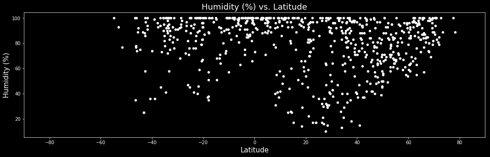
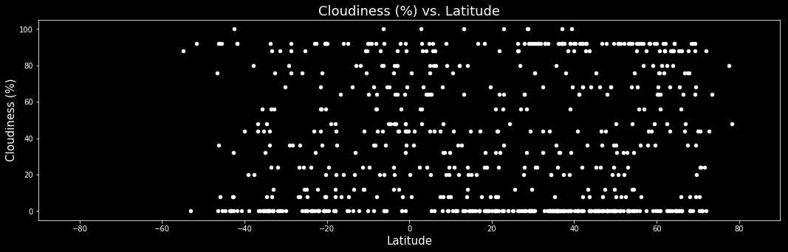
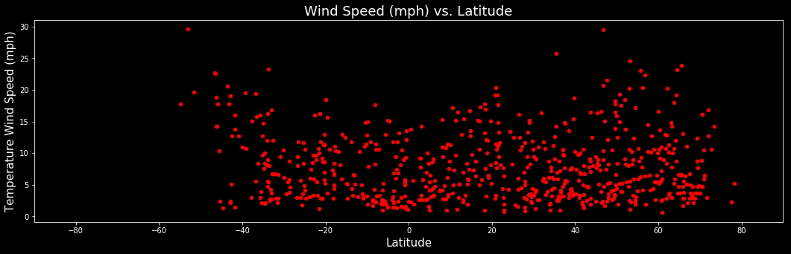

# ANALYSIS
1.With the Temperature and the latitude scatter plot, there is a positive correlation ie 
    an increase in temp increses lat
2.The average wind speed for all cities is fairly low in the winds speed and latitude 
    scatter plot
3.The wind speed are higher on average on the north and south poles.


```python
import pandas as pd
from citipy import citipy
import numpy as np
import pandas as pd
import requests
import json
import seaborn as sns
import matplotlib.pyplot as plt
%matplotlib inline
```

# Locate Nearest City


```python
#generate random list for latitudes and longitudes 

latitude = []
longitude = []

for each_lat in np.random.randint(-90,90,2000):
    latitude.append(each_lat)

for each_lon in np.random.randint(-180,180,2000):
    longitude.append(each_lon)
```

# Generate Dataframe for all latitudes and longitudes


```python
#Create and variable called latitude_and_Longitude and store all random latitudes and longitudes generated

latitude_and_Longitude = tuple(zip(latitude,longitude))
```


```python
#use citipy library to find the nearest city for all latitudes and longitudes

cities = []
country = []

for lat,lon in latitude_and_Longitude:
    city = citipy.nearest_city(lat,lon)
    
    cityName = city.city_name
    
    cities.append(cityName)
    
    country.append(city.country_code)
```


```python
#Print out how many the different cities were generated

print('The above script has generated {} different cities using random numbers.'.format(len(set(cities))))
```

    The above script has generated 786 different cities using random numbers.


```python
#create a dataframe to store all the cities and countries generated with citipy

df_countries = pd.DataFrame({'Cities': cities,
              'Country': country})

#add additional blank columns to store information from openweathermap api

df_countries['Latitude'] = ''
df_countries['Longitude'] = ''
df_countries['Temperature (F)'] = ''
df_countries['Humidity (%)'] = ''
df_countries['Cloudiness (%)'] = ''
df_countries['Wind Speed (mph)'] = ''
```


```python
#drop all duplicates in column Cities.

df_countries = df_countries.drop_duplicates(subset=['Cities'],keep='first')

#api key used with openweathermap api

api_key = "5be78fade1727ace968b5ab363d997bd"

# Use Openweathermap API

#loop through all rows and fill in values for blank columns in dataframe

for index,row in df_countries.iterrows():
    city_name = row['Cities']
    Country_id = row['Country']
    
    
    #api call for all Cities 
    api_url = "http://api.openweathermap.org/data/2.5/forecast" \
    "?q={},{}&units=IMPERIAL&mode=json&APPID={}".format(city_name,Country_id,api_key)
    
    
    country_info = requests.get(api_url).json()
    
    #print all api url's for each city
    print(api_url)
    
    
    try:
        df_countries.set_value(index,'Latitude',country_info['city']['coord']['lat'])
        df_countries.set_value(index,'Longitude',country_info['city']['coord']['lon'])
        df_countries.set_value(index,'Temperature (F)',country_info['list'][0]['main']['temp'])
        df_countries.set_value(index,'Humidity (%)',country_info['list'][0]['main']['humidity'])
        df_countries.set_value(index,'Cloudiness (%)',country_info['list'][0]['clouds']['all'])
        df_countries.set_value(index,'Wind Speed (mph)',country_info['list'][0]['wind']['speed'])
        
    except KeyError:
        df_countries.set_value(index,'Latitude',np.nan)
        df_countries.set_value(index,'Longitude',np.nan)
        df_countries.set_value(index,'Temperature (F)',np.nan)
        df_countries.set_value(index,'Humidity (%)',np.nan)
        df_countries.set_value(index,'Cloudiness (%)',np.nan)
        df_countries.set_value(index,'Wind Speed (mph)',np.nan)
        
        print('Missing weather information...skip')

#change all data recieved from openweathermap api to numerical data
df_countries['Latitude'] = pd.to_numeric(df_countries['Latitude'])
df_countries['Longitude'] = pd.to_numeric(df_countries['Longitude'])
df_countries['Temperature (F)'] = pd.to_numeric(df_countries['Temperature (F)'])
df_countries['Humidity (%)'] = pd.to_numeric(df_countries['Humidity (%)'])
df_countries['Cloudiness (%)'] = pd.to_numeric(df_countries['Cloudiness (%)'])
df_countries['Wind Speed (mph)'] = pd.to_numeric(df_countries['Wind Speed (mph)'])
```

    http://api.openweathermap.org/data/2.5/forecast?q=harper,lr&units=IMPERIAL&mode=json&APPID=5be78fade1727ace968b5ab363d997bd


    /anaconda3/lib/python3.6/site-packages/ipykernel/__main__.py:29: FutureWarning: set_value is deprecated and will be removed in a future release. Please use .at[] or .iat[] accessors instead
    /anaconda3/lib/python3.6/site-packages/ipykernel/__main__.py:30: FutureWarning: set_value is deprecated and will be removed in a future release. Please use .at[] or .iat[] accessors instead
    /anaconda3/lib/python3.6/site-packages/ipykernel/__main__.py:31: FutureWarning: set_value is deprecated and will be removed in a future release. Please use .at[] or .iat[] accessors instead
    /anaconda3/lib/python3.6/site-packages/ipykernel/__main__.py:32: FutureWarning: set_value is deprecated and will be removed in a future release. Please use .at[] or .iat[] accessors instead
    /anaconda3/lib/python3.6/site-packages/ipykernel/__main__.py:33: FutureWarning: set_value is deprecated and will be removed in a future release. Please use .at[] or .iat[] accessors instead
    /anaconda3/lib/python3.6/site-packages/ipykernel/__main__.py:34: FutureWarning: set_value is deprecated and will be removed in a future release. Please use .at[] or .iat[] accessors instead


    http://api.openweathermap.org/data/2.5/forecast?q=tuktoyaktuk,ca&units=IMPERIAL&mode=json&APPID=5be78fade1727ace968b5ab363d997bd
    http://api.openweathermap.org/data/2.5/forecast?q=hilo,us&units=IMPERIAL&mode=json&APPID=5be78fade1727ace968b5ab363d997bd
    http://api.openweathermap.org/data/2.5/forecast?q=pathardi,in&units=IMPERIAL&mode=json&APPID=5be78fade1727ace968b5ab363d997bd
    http://api.openweathermap.org/data/2.5/forecast?q=new waterford,ca&units=IMPERIAL&mode=json&APPID=5be78fade1727ace968b5ab363d997bd
    http://api.openweathermap.org/data/2.5/forecast?q=westwood,us&units=IMPERIAL&mode=json&APPID=5be78fade1727ace968b5ab363d997bd
    http://api.openweathermap.org/data/2.5/forecast?q=hermanus,za&units=IMPERIAL&mode=json&APPID=5be78fade1727ace968b5ab363d997bd
    http://api.openweathermap.org/data/2.5/forecast?q=puerto rico,co&units=IMPERIAL&mode=json&APPID=5be78fade1727ace968b5ab363d997bd
    http://api.openweathermap.org/data/2.5/forecast?q=tam ky,vn&units=IMPERIAL&mode=json&APPID=5be78fade1727ace968b5ab363d997bd
    http://api.openweathermap.org/data/2.5/forecast?q=rikitea,pf&units=IMPERIAL&mode=json&APPID=5be78fade1727ace968b5ab363d997bd
    http://api.openweathermap.org/data/2.5/forecast?q=maceio,br&units=IMPERIAL&mode=json&APPID=5be78fade1727ace968b5ab363d997bd
    http://api.openweathermap.org/data/2.5/forecast?q=beringovskiy,ru&units=IMPERIAL&mode=json&APPID=5be78fade1727ace968b5ab363d997bd
    http://api.openweathermap.org/data/2.5/forecast?q=butaritari,ki&units=IMPERIAL&mode=json&APPID=5be78fade1727ace968b5ab363d997bd
    http://api.openweathermap.org/data/2.5/forecast?q=tomatlan,mx&units=IMPERIAL&mode=json&APPID=5be78fade1727ace968b5ab363d997bd
    http://api.openweathermap.org/data/2.5/forecast?q=bluff,nz&units=IMPERIAL&mode=json&APPID=5be78fade1727ace968b5ab363d997bd
    http://api.openweathermap.org/data/2.5/forecast?q=bengkulu,id&units=IMPERIAL&mode=json&APPID=5be78fade1727ace968b5ab363d997bd
    Missing weather information...skip


    /anaconda3/lib/python3.6/site-packages/ipykernel/__main__.py:37: FutureWarning: set_value is deprecated and will be removed in a future release. Please use .at[] or .iat[] accessors instead
    /anaconda3/lib/python3.6/site-packages/ipykernel/__main__.py:38: FutureWarning: set_value is deprecated and will be removed in a future release. Please use .at[] or .iat[] accessors instead
    /anaconda3/lib/python3.6/site-packages/ipykernel/__main__.py:39: FutureWarning: set_value is deprecated and will be removed in a future release. Please use .at[] or .iat[] accessors instead
    /anaconda3/lib/python3.6/site-packages/ipykernel/__main__.py:40: FutureWarning: set_value is deprecated and will be removed in a future release. Please use .at[] or .iat[] accessors instead
    /anaconda3/lib/python3.6/site-packages/ipykernel/__main__.py:41: FutureWarning: set_value is deprecated and will be removed in a future release. Please use .at[] or .iat[] accessors instead
    /anaconda3/lib/python3.6/site-packages/ipykernel/__main__.py:42: FutureWarning: set_value is deprecated and will be removed in a future release. Please use .at[] or .iat[] accessors instead


    http://api.openweathermap.org/data/2.5/forecast?q=yantzaza,ec&units=IMPERIAL&mode=json&APPID=5be78fade1727ace968b5ab363d997bd
    http://api.openweathermap.org/data/2.5/forecast?q=taolanaro,mg&units=IMPERIAL&mode=json&APPID=5be78fade1727ace968b5ab363d997bd
    Missing weather information...skip
    http://api.openweathermap.org/data/2.5/forecast?q=kuytun,cn&units=IMPERIAL&mode=json&APPID=5be78fade1727ace968b5ab363d997bd
    Missing weather information...skip
    http://api.openweathermap.org/data/2.5/forecast?q=dikson,ru&units=IMPERIAL&mode=json&APPID=5be78fade1727ace968b5ab363d997bd
    http://api.openweathermap.org/data/2.5/forecast?q=ambodifototra,mg&units=IMPERIAL&mode=json&APPID=5be78fade1727ace968b5ab363d997bd
    Missing weather information...skip
    http://api.openweathermap.org/data/2.5/forecast?q=katsuura,jp&units=IMPERIAL&mode=json&APPID=5be78fade1727ace968b5ab363d997bd
    http://api.openweathermap.org/data/2.5/forecast?q=mount gambier,au&units=IMPERIAL&mode=json&APPID=5be78fade1727ace968b5ab363d997bd
    http://api.openweathermap.org/data/2.5/forecast?q=port pirie,au&units=IMPERIAL&mode=json&APPID=5be78fade1727ace968b5ab363d997bd
    http://api.openweathermap.org/data/2.5/forecast?q=nizhneyansk,ru&units=IMPERIAL&mode=json&APPID=5be78fade1727ace968b5ab363d997bd
    Missing weather information...skip
    http://api.openweathermap.org/data/2.5/forecast?q=acin,af&units=IMPERIAL&mode=json&APPID=5be78fade1727ace968b5ab363d997bd
    Missing weather information...skip
    http://api.openweathermap.org/data/2.5/forecast?q=arraial do cabo,br&units=IMPERIAL&mode=json&APPID=5be78fade1727ace968b5ab363d997bd
    http://api.openweathermap.org/data/2.5/forecast?q=carros,fr&units=IMPERIAL&mode=json&APPID=5be78fade1727ace968b5ab363d997bd
    http://api.openweathermap.org/data/2.5/forecast?q=lugoba,tz&units=IMPERIAL&mode=json&APPID=5be78fade1727ace968b5ab363d997bd
    http://api.openweathermap.org/data/2.5/forecast?q=ilulissat,gl&units=IMPERIAL&mode=json&APPID=5be78fade1727ace968b5ab363d997bd
    http://api.openweathermap.org/data/2.5/forecast?q=ondangwa,na&units=IMPERIAL&mode=json&APPID=5be78fade1727ace968b5ab363d997bd
    http://api.openweathermap.org/data/2.5/forecast?q=bethel,us&units=IMPERIAL&mode=json&APPID=5be78fade1727ace968b5ab363d997bd
    http://api.openweathermap.org/data/2.5/forecast?q=aguas belas,br&units=IMPERIAL&mode=json&APPID=5be78fade1727ace968b5ab363d997bd
    http://api.openweathermap.org/data/2.5/forecast?q=hovd,mn&units=IMPERIAL&mode=json&APPID=5be78fade1727ace968b5ab363d997bd
    http://api.openweathermap.org/data/2.5/forecast?q=copaceni,ro&units=IMPERIAL&mode=json&APPID=5be78fade1727ace968b5ab363d997bd
    http://api.openweathermap.org/data/2.5/forecast?q=port alfred,za&units=IMPERIAL&mode=json&APPID=5be78fade1727ace968b5ab363d997bd
    http://api.openweathermap.org/data/2.5/forecast?q=chuy,uy&units=IMPERIAL&mode=json&APPID=5be78fade1727ace968b5ab363d997bd
    http://api.openweathermap.org/data/2.5/forecast?q=warqla,dz&units=IMPERIAL&mode=json&APPID=5be78fade1727ace968b5ab363d997bd
    Missing weather information...skip
    http://api.openweathermap.org/data/2.5/forecast?q=kasempa,zm&units=IMPERIAL&mode=json&APPID=5be78fade1727ace968b5ab363d997bd
    http://api.openweathermap.org/data/2.5/forecast?q=manicore,br&units=IMPERIAL&mode=json&APPID=5be78fade1727ace968b5ab363d997bd
    http://api.openweathermap.org/data/2.5/forecast?q=ordzhonikidze,ua&units=IMPERIAL&mode=json&APPID=5be78fade1727ace968b5ab363d997bd
    http://api.openweathermap.org/data/2.5/forecast?q=mahebourg,mu&units=IMPERIAL&mode=json&APPID=5be78fade1727ace968b5ab363d997bd
    http://api.openweathermap.org/data/2.5/forecast?q=san quintin,mx&units=IMPERIAL&mode=json&APPID=5be78fade1727ace968b5ab363d997bd
    Missing weather information...skip
    http://api.openweathermap.org/data/2.5/forecast?q=praia,cv&units=IMPERIAL&mode=json&APPID=5be78fade1727ace968b5ab363d997bd
    http://api.openweathermap.org/data/2.5/forecast?q=kenitra,ma&units=IMPERIAL&mode=json&APPID=5be78fade1727ace968b5ab363d997bd
    http://api.openweathermap.org/data/2.5/forecast?q=urdoma,ru&units=IMPERIAL&mode=json&APPID=5be78fade1727ace968b5ab363d997bd
    http://api.openweathermap.org/data/2.5/forecast?q=tuatapere,nz&units=IMPERIAL&mode=json&APPID=5be78fade1727ace968b5ab363d997bd
    http://api.openweathermap.org/data/2.5/forecast?q=calvinia,za&units=IMPERIAL&mode=json&APPID=5be78fade1727ace968b5ab363d997bd
    http://api.openweathermap.org/data/2.5/forecast?q=cidreira,br&units=IMPERIAL&mode=json&APPID=5be78fade1727ace968b5ab363d997bd
    http://api.openweathermap.org/data/2.5/forecast?q=puerto ayora,ec&units=IMPERIAL&mode=json&APPID=5be78fade1727ace968b5ab363d997bd
    http://api.openweathermap.org/data/2.5/forecast?q=pisco,pe&units=IMPERIAL&mode=json&APPID=5be78fade1727ace968b5ab363d997bd
    http://api.openweathermap.org/data/2.5/forecast?q=bredasdorp,za&units=IMPERIAL&mode=json&APPID=5be78fade1727ace968b5ab363d997bd
    http://api.openweathermap.org/data/2.5/forecast?q=cabo san lucas,mx&units=IMPERIAL&mode=json&APPID=5be78fade1727ace968b5ab363d997bd
    http://api.openweathermap.org/data/2.5/forecast?q=sigli,id&units=IMPERIAL&mode=json&APPID=5be78fade1727ace968b5ab363d997bd
    http://api.openweathermap.org/data/2.5/forecast?q=busselton,au&units=IMPERIAL&mode=json&APPID=5be78fade1727ace968b5ab363d997bd
    http://api.openweathermap.org/data/2.5/forecast?q=coihaique,cl&units=IMPERIAL&mode=json&APPID=5be78fade1727ace968b5ab363d997bd
    http://api.openweathermap.org/data/2.5/forecast?q=vaitupu,wf&units=IMPERIAL&mode=json&APPID=5be78fade1727ace968b5ab363d997bd
    Missing weather information...skip
    http://api.openweathermap.org/data/2.5/forecast?q=pindiga,ng&units=IMPERIAL&mode=json&APPID=5be78fade1727ace968b5ab363d997bd
    http://api.openweathermap.org/data/2.5/forecast?q=nagato,jp&units=IMPERIAL&mode=json&APPID=5be78fade1727ace968b5ab363d997bd
    http://api.openweathermap.org/data/2.5/forecast?q=kamenka,ru&units=IMPERIAL&mode=json&APPID=5be78fade1727ace968b5ab363d997bd
    http://api.openweathermap.org/data/2.5/forecast?q=nyurba,ru&units=IMPERIAL&mode=json&APPID=5be78fade1727ace968b5ab363d997bd
    http://api.openweathermap.org/data/2.5/forecast?q=jumla,np&units=IMPERIAL&mode=json&APPID=5be78fade1727ace968b5ab363d997bd
    http://api.openweathermap.org/data/2.5/forecast?q=ushuaia,ar&units=IMPERIAL&mode=json&APPID=5be78fade1727ace968b5ab363d997bd
    http://api.openweathermap.org/data/2.5/forecast?q=punta arenas,cl&units=IMPERIAL&mode=json&APPID=5be78fade1727ace968b5ab363d997bd
    http://api.openweathermap.org/data/2.5/forecast?q=koumac,nc&units=IMPERIAL&mode=json&APPID=5be78fade1727ace968b5ab363d997bd
    http://api.openweathermap.org/data/2.5/forecast?q=mataura,pf&units=IMPERIAL&mode=json&APPID=5be78fade1727ace968b5ab363d997bd
    Missing weather information...skip
    http://api.openweathermap.org/data/2.5/forecast?q=kiunga,pg&units=IMPERIAL&mode=json&APPID=5be78fade1727ace968b5ab363d997bd
    http://api.openweathermap.org/data/2.5/forecast?q=alofi,nu&units=IMPERIAL&mode=json&APPID=5be78fade1727ace968b5ab363d997bd
    http://api.openweathermap.org/data/2.5/forecast?q=bukachacha,ru&units=IMPERIAL&mode=json&APPID=5be78fade1727ace968b5ab363d997bd
    http://api.openweathermap.org/data/2.5/forecast?q=marzuq,ly&units=IMPERIAL&mode=json&APPID=5be78fade1727ace968b5ab363d997bd
    Missing weather information...skip
    http://api.openweathermap.org/data/2.5/forecast?q=novoyegoryevskoye,ru&units=IMPERIAL&mode=json&APPID=5be78fade1727ace968b5ab363d997bd
    Missing weather information...skip
    http://api.openweathermap.org/data/2.5/forecast?q=victoria,sc&units=IMPERIAL&mode=json&APPID=5be78fade1727ace968b5ab363d997bd
    http://api.openweathermap.org/data/2.5/forecast?q=jamestown,sh&units=IMPERIAL&mode=json&APPID=5be78fade1727ace968b5ab363d997bd
    http://api.openweathermap.org/data/2.5/forecast?q=halalo,wf&units=IMPERIAL&mode=json&APPID=5be78fade1727ace968b5ab363d997bd
    Missing weather information...skip
    http://api.openweathermap.org/data/2.5/forecast?q=cottonwood,us&units=IMPERIAL&mode=json&APPID=5be78fade1727ace968b5ab363d997bd
    http://api.openweathermap.org/data/2.5/forecast?q=ostrovnoy,ru&units=IMPERIAL&mode=json&APPID=5be78fade1727ace968b5ab363d997bd
    http://api.openweathermap.org/data/2.5/forecast?q=anton lizardo,mx&units=IMPERIAL&mode=json&APPID=5be78fade1727ace968b5ab363d997bd
    http://api.openweathermap.org/data/2.5/forecast?q=karratha,au&units=IMPERIAL&mode=json&APPID=5be78fade1727ace968b5ab363d997bd
    http://api.openweathermap.org/data/2.5/forecast?q=castro,cl&units=IMPERIAL&mode=json&APPID=5be78fade1727ace968b5ab363d997bd
    http://api.openweathermap.org/data/2.5/forecast?q=zhangye,cn&units=IMPERIAL&mode=json&APPID=5be78fade1727ace968b5ab363d997bd
    http://api.openweathermap.org/data/2.5/forecast?q=mujiayingzi,cn&units=IMPERIAL&mode=json&APPID=5be78fade1727ace968b5ab363d997bd
    http://api.openweathermap.org/data/2.5/forecast?q=gat,ly&units=IMPERIAL&mode=json&APPID=5be78fade1727ace968b5ab363d997bd
    Missing weather information...skip
    http://api.openweathermap.org/data/2.5/forecast?q=husavik,is&units=IMPERIAL&mode=json&APPID=5be78fade1727ace968b5ab363d997bd
    http://api.openweathermap.org/data/2.5/forecast?q=bambous virieux,mu&units=IMPERIAL&mode=json&APPID=5be78fade1727ace968b5ab363d997bd
    http://api.openweathermap.org/data/2.5/forecast?q=tursunzoda,tj&units=IMPERIAL&mode=json&APPID=5be78fade1727ace968b5ab363d997bd
    http://api.openweathermap.org/data/2.5/forecast?q=sao joao da barra,br&units=IMPERIAL&mode=json&APPID=5be78fade1727ace968b5ab363d997bd
    http://api.openweathermap.org/data/2.5/forecast?q=albany,au&units=IMPERIAL&mode=json&APPID=5be78fade1727ace968b5ab363d997bd
    http://api.openweathermap.org/data/2.5/forecast?q=vaini,to&units=IMPERIAL&mode=json&APPID=5be78fade1727ace968b5ab363d997bd
    http://api.openweathermap.org/data/2.5/forecast?q=cape town,za&units=IMPERIAL&mode=json&APPID=5be78fade1727ace968b5ab363d997bd
    http://api.openweathermap.org/data/2.5/forecast?q=saint-joseph,re&units=IMPERIAL&mode=json&APPID=5be78fade1727ace968b5ab363d997bd
    http://api.openweathermap.org/data/2.5/forecast?q=taoudenni,ml&units=IMPERIAL&mode=json&APPID=5be78fade1727ace968b5ab363d997bd
    http://api.openweathermap.org/data/2.5/forecast?q=port hedland,au&units=IMPERIAL&mode=json&APPID=5be78fade1727ace968b5ab363d997bd
    http://api.openweathermap.org/data/2.5/forecast?q=bogorodskoye,ru&units=IMPERIAL&mode=json&APPID=5be78fade1727ace968b5ab363d997bd
    http://api.openweathermap.org/data/2.5/forecast?q=east london,za&units=IMPERIAL&mode=json&APPID=5be78fade1727ace968b5ab363d997bd
    http://api.openweathermap.org/data/2.5/forecast?q=lompoc,us&units=IMPERIAL&mode=json&APPID=5be78fade1727ace968b5ab363d997bd
    http://api.openweathermap.org/data/2.5/forecast?q=kaitangata,nz&units=IMPERIAL&mode=json&APPID=5be78fade1727ace968b5ab363d997bd
    http://api.openweathermap.org/data/2.5/forecast?q=narsaq,gl&units=IMPERIAL&mode=json&APPID=5be78fade1727ace968b5ab363d997bd
    http://api.openweathermap.org/data/2.5/forecast?q=qorveh,ir&units=IMPERIAL&mode=json&APPID=5be78fade1727ace968b5ab363d997bd
    http://api.openweathermap.org/data/2.5/forecast?q=hudson bay,ca&units=IMPERIAL&mode=json&APPID=5be78fade1727ace968b5ab363d997bd
    http://api.openweathermap.org/data/2.5/forecast?q=grindavik,is&units=IMPERIAL&mode=json&APPID=5be78fade1727ace968b5ab363d997bd
    http://api.openweathermap.org/data/2.5/forecast?q=toungoo,mm&units=IMPERIAL&mode=json&APPID=5be78fade1727ace968b5ab363d997bd
    Missing weather information...skip
    http://api.openweathermap.org/data/2.5/forecast?q=barentsburg,sj&units=IMPERIAL&mode=json&APPID=5be78fade1727ace968b5ab363d997bd
    Missing weather information...skip
    http://api.openweathermap.org/data/2.5/forecast?q=khatanga,ru&units=IMPERIAL&mode=json&APPID=5be78fade1727ace968b5ab363d997bd
    http://api.openweathermap.org/data/2.5/forecast?q=cockburn town,tc&units=IMPERIAL&mode=json&APPID=5be78fade1727ace968b5ab363d997bd
    http://api.openweathermap.org/data/2.5/forecast?q=namie,jp&units=IMPERIAL&mode=json&APPID=5be78fade1727ace968b5ab363d997bd
    http://api.openweathermap.org/data/2.5/forecast?q=atuona,pf&units=IMPERIAL&mode=json&APPID=5be78fade1727ace968b5ab363d997bd
    http://api.openweathermap.org/data/2.5/forecast?q=amapa,br&units=IMPERIAL&mode=json&APPID=5be78fade1727ace968b5ab363d997bd
    http://api.openweathermap.org/data/2.5/forecast?q=westport,nz&units=IMPERIAL&mode=json&APPID=5be78fade1727ace968b5ab363d997bd
    http://api.openweathermap.org/data/2.5/forecast?q=buenos aires,cr&units=IMPERIAL&mode=json&APPID=5be78fade1727ace968b5ab363d997bd
    http://api.openweathermap.org/data/2.5/forecast?q=fort nelson,ca&units=IMPERIAL&mode=json&APPID=5be78fade1727ace968b5ab363d997bd
    http://api.openweathermap.org/data/2.5/forecast?q=coquimbo,cl&units=IMPERIAL&mode=json&APPID=5be78fade1727ace968b5ab363d997bd
    http://api.openweathermap.org/data/2.5/forecast?q=avarua,ck&units=IMPERIAL&mode=json&APPID=5be78fade1727ace968b5ab363d997bd
    http://api.openweathermap.org/data/2.5/forecast?q=bilibino,ru&units=IMPERIAL&mode=json&APPID=5be78fade1727ace968b5ab363d997bd
    http://api.openweathermap.org/data/2.5/forecast?q=nkhotakota,mw&units=IMPERIAL&mode=json&APPID=5be78fade1727ace968b5ab363d997bd
    http://api.openweathermap.org/data/2.5/forecast?q=qasigiannguit,gl&units=IMPERIAL&mode=json&APPID=5be78fade1727ace968b5ab363d997bd
    http://api.openweathermap.org/data/2.5/forecast?q=marau,br&units=IMPERIAL&mode=json&APPID=5be78fade1727ace968b5ab363d997bd
    http://api.openweathermap.org/data/2.5/forecast?q=carnarvon,au&units=IMPERIAL&mode=json&APPID=5be78fade1727ace968b5ab363d997bd
    http://api.openweathermap.org/data/2.5/forecast?q=ialibu,pg&units=IMPERIAL&mode=json&APPID=5be78fade1727ace968b5ab363d997bd
    http://api.openweathermap.org/data/2.5/forecast?q=pevek,ru&units=IMPERIAL&mode=json&APPID=5be78fade1727ace968b5ab363d997bd
    http://api.openweathermap.org/data/2.5/forecast?q=verona,us&units=IMPERIAL&mode=json&APPID=5be78fade1727ace968b5ab363d997bd
    http://api.openweathermap.org/data/2.5/forecast?q=rio gallegos,ar&units=IMPERIAL&mode=json&APPID=5be78fade1727ace968b5ab363d997bd
    http://api.openweathermap.org/data/2.5/forecast?q=waipawa,nz&units=IMPERIAL&mode=json&APPID=5be78fade1727ace968b5ab363d997bd
    http://api.openweathermap.org/data/2.5/forecast?q=hay river,ca&units=IMPERIAL&mode=json&APPID=5be78fade1727ace968b5ab363d997bd
    http://api.openweathermap.org/data/2.5/forecast?q=saint-pierre,pm&units=IMPERIAL&mode=json&APPID=5be78fade1727ace968b5ab363d997bd
    http://api.openweathermap.org/data/2.5/forecast?q=benoy,td&units=IMPERIAL&mode=json&APPID=5be78fade1727ace968b5ab363d997bd
    http://api.openweathermap.org/data/2.5/forecast?q=lavrentiya,ru&units=IMPERIAL&mode=json&APPID=5be78fade1727ace968b5ab363d997bd
    http://api.openweathermap.org/data/2.5/forecast?q=ust-maya,ru&units=IMPERIAL&mode=json&APPID=5be78fade1727ace968b5ab363d997bd
    http://api.openweathermap.org/data/2.5/forecast?q=kamyshla,ru&units=IMPERIAL&mode=json&APPID=5be78fade1727ace968b5ab363d997bd
    http://api.openweathermap.org/data/2.5/forecast?q=puro,ph&units=IMPERIAL&mode=json&APPID=5be78fade1727ace968b5ab363d997bd
    http://api.openweathermap.org/data/2.5/forecast?q=illoqqortoormiut,gl&units=IMPERIAL&mode=json&APPID=5be78fade1727ace968b5ab363d997bd
    Missing weather information...skip
    http://api.openweathermap.org/data/2.5/forecast?q=hasaki,jp&units=IMPERIAL&mode=json&APPID=5be78fade1727ace968b5ab363d997bd
    http://api.openweathermap.org/data/2.5/forecast?q=torbay,ca&units=IMPERIAL&mode=json&APPID=5be78fade1727ace968b5ab363d997bd
    http://api.openweathermap.org/data/2.5/forecast?q=kolarovo,sk&units=IMPERIAL&mode=json&APPID=5be78fade1727ace968b5ab363d997bd
    http://api.openweathermap.org/data/2.5/forecast?q=vao,nc&units=IMPERIAL&mode=json&APPID=5be78fade1727ace968b5ab363d997bd
    http://api.openweathermap.org/data/2.5/forecast?q=saskylakh,ru&units=IMPERIAL&mode=json&APPID=5be78fade1727ace968b5ab363d997bd
    http://api.openweathermap.org/data/2.5/forecast?q=clyde river,ca&units=IMPERIAL&mode=json&APPID=5be78fade1727ace968b5ab363d997bd
    http://api.openweathermap.org/data/2.5/forecast?q=san policarpo,ph&units=IMPERIAL&mode=json&APPID=5be78fade1727ace968b5ab363d997bd
    http://api.openweathermap.org/data/2.5/forecast?q=eureka,us&units=IMPERIAL&mode=json&APPID=5be78fade1727ace968b5ab363d997bd
    http://api.openweathermap.org/data/2.5/forecast?q=bosobolo,cd&units=IMPERIAL&mode=json&APPID=5be78fade1727ace968b5ab363d997bd
    http://api.openweathermap.org/data/2.5/forecast?q=gurupa,br&units=IMPERIAL&mode=json&APPID=5be78fade1727ace968b5ab363d997bd
    Missing weather information...skip
    http://api.openweathermap.org/data/2.5/forecast?q=tulun,ru&units=IMPERIAL&mode=json&APPID=5be78fade1727ace968b5ab363d997bd
    http://api.openweathermap.org/data/2.5/forecast?q=kapaa,us&units=IMPERIAL&mode=json&APPID=5be78fade1727ace968b5ab363d997bd
    http://api.openweathermap.org/data/2.5/forecast?q=chokurdakh,ru&units=IMPERIAL&mode=json&APPID=5be78fade1727ace968b5ab363d997bd
    http://api.openweathermap.org/data/2.5/forecast?q=dondo,mz&units=IMPERIAL&mode=json&APPID=5be78fade1727ace968b5ab363d997bd
    http://api.openweathermap.org/data/2.5/forecast?q=lodja,cd&units=IMPERIAL&mode=json&APPID=5be78fade1727ace968b5ab363d997bd
    http://api.openweathermap.org/data/2.5/forecast?q=sept-iles,ca&units=IMPERIAL&mode=json&APPID=5be78fade1727ace968b5ab363d997bd
    http://api.openweathermap.org/data/2.5/forecast?q=provideniya,ru&units=IMPERIAL&mode=json&APPID=5be78fade1727ace968b5ab363d997bd
    http://api.openweathermap.org/data/2.5/forecast?q=mys shmidta,ru&units=IMPERIAL&mode=json&APPID=5be78fade1727ace968b5ab363d997bd
    Missing weather information...skip
    http://api.openweathermap.org/data/2.5/forecast?q=vieques,us&units=IMPERIAL&mode=json&APPID=5be78fade1727ace968b5ab363d997bd
    Missing weather information...skip
    http://api.openweathermap.org/data/2.5/forecast?q=san felipe,mx&units=IMPERIAL&mode=json&APPID=5be78fade1727ace968b5ab363d997bd
    http://api.openweathermap.org/data/2.5/forecast?q=teguise,es&units=IMPERIAL&mode=json&APPID=5be78fade1727ace968b5ab363d997bd
    http://api.openweathermap.org/data/2.5/forecast?q=shadegan,ir&units=IMPERIAL&mode=json&APPID=5be78fade1727ace968b5ab363d997bd
    http://api.openweathermap.org/data/2.5/forecast?q=mokobeng,bw&units=IMPERIAL&mode=json&APPID=5be78fade1727ace968b5ab363d997bd
    http://api.openweathermap.org/data/2.5/forecast?q=coahuayana,mx&units=IMPERIAL&mode=json&APPID=5be78fade1727ace968b5ab363d997bd
    http://api.openweathermap.org/data/2.5/forecast?q=ardesen,tr&units=IMPERIAL&mode=json&APPID=5be78fade1727ace968b5ab363d997bd
    http://api.openweathermap.org/data/2.5/forecast?q=afgoye,so&units=IMPERIAL&mode=json&APPID=5be78fade1727ace968b5ab363d997bd
    Missing weather information...skip
    http://api.openweathermap.org/data/2.5/forecast?q=sorvag,fo&units=IMPERIAL&mode=json&APPID=5be78fade1727ace968b5ab363d997bd
    Missing weather information...skip
    http://api.openweathermap.org/data/2.5/forecast?q=sirjan,ir&units=IMPERIAL&mode=json&APPID=5be78fade1727ace968b5ab363d997bd
    http://api.openweathermap.org/data/2.5/forecast?q=tumannyy,ru&units=IMPERIAL&mode=json&APPID=5be78fade1727ace968b5ab363d997bd
    Missing weather information...skip
    http://api.openweathermap.org/data/2.5/forecast?q=port lincoln,au&units=IMPERIAL&mode=json&APPID=5be78fade1727ace968b5ab363d997bd
    http://api.openweathermap.org/data/2.5/forecast?q=fushun,cn&units=IMPERIAL&mode=json&APPID=5be78fade1727ace968b5ab363d997bd
    http://api.openweathermap.org/data/2.5/forecast?q=tsihombe,mg&units=IMPERIAL&mode=json&APPID=5be78fade1727ace968b5ab363d997bd
    Missing weather information...skip
    http://api.openweathermap.org/data/2.5/forecast?q=upernavik,gl&units=IMPERIAL&mode=json&APPID=5be78fade1727ace968b5ab363d997bd
    http://api.openweathermap.org/data/2.5/forecast?q=gazanjyk,tm&units=IMPERIAL&mode=json&APPID=5be78fade1727ace968b5ab363d997bd
    http://api.openweathermap.org/data/2.5/forecast?q=tarakan,id&units=IMPERIAL&mode=json&APPID=5be78fade1727ace968b5ab363d997bd
    http://api.openweathermap.org/data/2.5/forecast?q=lagoa,pt&units=IMPERIAL&mode=json&APPID=5be78fade1727ace968b5ab363d997bd
    http://api.openweathermap.org/data/2.5/forecast?q=amboise,fr&units=IMPERIAL&mode=json&APPID=5be78fade1727ace968b5ab363d997bd
    http://api.openweathermap.org/data/2.5/forecast?q=hobart,au&units=IMPERIAL&mode=json&APPID=5be78fade1727ace968b5ab363d997bd
    http://api.openweathermap.org/data/2.5/forecast?q=venezuela,cu&units=IMPERIAL&mode=json&APPID=5be78fade1727ace968b5ab363d997bd
    http://api.openweathermap.org/data/2.5/forecast?q=okato,nz&units=IMPERIAL&mode=json&APPID=5be78fade1727ace968b5ab363d997bd
    http://api.openweathermap.org/data/2.5/forecast?q=beisfjord,no&units=IMPERIAL&mode=json&APPID=5be78fade1727ace968b5ab363d997bd
    http://api.openweathermap.org/data/2.5/forecast?q=mar del plata,ar&units=IMPERIAL&mode=json&APPID=5be78fade1727ace968b5ab363d997bd
    http://api.openweathermap.org/data/2.5/forecast?q=yerbogachen,ru&units=IMPERIAL&mode=json&APPID=5be78fade1727ace968b5ab363d997bd
    http://api.openweathermap.org/data/2.5/forecast?q=barrow,us&units=IMPERIAL&mode=json&APPID=5be78fade1727ace968b5ab363d997bd
    http://api.openweathermap.org/data/2.5/forecast?q=broome,au&units=IMPERIAL&mode=json&APPID=5be78fade1727ace968b5ab363d997bd
    http://api.openweathermap.org/data/2.5/forecast?q=nushki,pk&units=IMPERIAL&mode=json&APPID=5be78fade1727ace968b5ab363d997bd
    http://api.openweathermap.org/data/2.5/forecast?q=kavieng,pg&units=IMPERIAL&mode=json&APPID=5be78fade1727ace968b5ab363d997bd
    http://api.openweathermap.org/data/2.5/forecast?q=kodiak,us&units=IMPERIAL&mode=json&APPID=5be78fade1727ace968b5ab363d997bd
    http://api.openweathermap.org/data/2.5/forecast?q=shchigry,ru&units=IMPERIAL&mode=json&APPID=5be78fade1727ace968b5ab363d997bd
    http://api.openweathermap.org/data/2.5/forecast?q=kisangani,cd&units=IMPERIAL&mode=json&APPID=5be78fade1727ace968b5ab363d997bd
    http://api.openweathermap.org/data/2.5/forecast?q=ekhabi,ru&units=IMPERIAL&mode=json&APPID=5be78fade1727ace968b5ab363d997bd
    http://api.openweathermap.org/data/2.5/forecast?q=stornoway,gb&units=IMPERIAL&mode=json&APPID=5be78fade1727ace968b5ab363d997bd
    http://api.openweathermap.org/data/2.5/forecast?q=thompson,ca&units=IMPERIAL&mode=json&APPID=5be78fade1727ace968b5ab363d997bd
    http://api.openweathermap.org/data/2.5/forecast?q=new norfolk,au&units=IMPERIAL&mode=json&APPID=5be78fade1727ace968b5ab363d997bd
    http://api.openweathermap.org/data/2.5/forecast?q=norman wells,ca&units=IMPERIAL&mode=json&APPID=5be78fade1727ace968b5ab363d997bd
    http://api.openweathermap.org/data/2.5/forecast?q=quatre cocos,mu&units=IMPERIAL&mode=json&APPID=5be78fade1727ace968b5ab363d997bd
    http://api.openweathermap.org/data/2.5/forecast?q=la ronge,ca&units=IMPERIAL&mode=json&APPID=5be78fade1727ace968b5ab363d997bd
    http://api.openweathermap.org/data/2.5/forecast?q=pangnirtung,ca&units=IMPERIAL&mode=json&APPID=5be78fade1727ace968b5ab363d997bd
    http://api.openweathermap.org/data/2.5/forecast?q=bathsheba,bb&units=IMPERIAL&mode=json&APPID=5be78fade1727ace968b5ab363d997bd
    http://api.openweathermap.org/data/2.5/forecast?q=bayan,kw&units=IMPERIAL&mode=json&APPID=5be78fade1727ace968b5ab363d997bd
    http://api.openweathermap.org/data/2.5/forecast?q=qarqin,af&units=IMPERIAL&mode=json&APPID=5be78fade1727ace968b5ab363d997bd
    http://api.openweathermap.org/data/2.5/forecast?q=boa vista,br&units=IMPERIAL&mode=json&APPID=5be78fade1727ace968b5ab363d997bd
    http://api.openweathermap.org/data/2.5/forecast?q=hami,cn&units=IMPERIAL&mode=json&APPID=5be78fade1727ace968b5ab363d997bd
    http://api.openweathermap.org/data/2.5/forecast?q=fortuna,us&units=IMPERIAL&mode=json&APPID=5be78fade1727ace968b5ab363d997bd
    http://api.openweathermap.org/data/2.5/forecast?q=airai,pw&units=IMPERIAL&mode=json&APPID=5be78fade1727ace968b5ab363d997bd
    Missing weather information...skip
    http://api.openweathermap.org/data/2.5/forecast?q=cazones,mx&units=IMPERIAL&mode=json&APPID=5be78fade1727ace968b5ab363d997bd
    http://api.openweathermap.org/data/2.5/forecast?q=suez,eg&units=IMPERIAL&mode=json&APPID=5be78fade1727ace968b5ab363d997bd
    http://api.openweathermap.org/data/2.5/forecast?q=tucuma,br&units=IMPERIAL&mode=json&APPID=5be78fade1727ace968b5ab363d997bd
    Missing weather information...skip
    http://api.openweathermap.org/data/2.5/forecast?q=huarmey,pe&units=IMPERIAL&mode=json&APPID=5be78fade1727ace968b5ab363d997bd
    http://api.openweathermap.org/data/2.5/forecast?q=svetlaya,ru&units=IMPERIAL&mode=json&APPID=5be78fade1727ace968b5ab363d997bd
    http://api.openweathermap.org/data/2.5/forecast?q=vanimo,pg&units=IMPERIAL&mode=json&APPID=5be78fade1727ace968b5ab363d997bd
    http://api.openweathermap.org/data/2.5/forecast?q=aktau,kz&units=IMPERIAL&mode=json&APPID=5be78fade1727ace968b5ab363d997bd
    http://api.openweathermap.org/data/2.5/forecast?q=don sak,th&units=IMPERIAL&mode=json&APPID=5be78fade1727ace968b5ab363d997bd
    http://api.openweathermap.org/data/2.5/forecast?q=bagdarin,ru&units=IMPERIAL&mode=json&APPID=5be78fade1727ace968b5ab363d997bd
    http://api.openweathermap.org/data/2.5/forecast?q=sovetskiy,ru&units=IMPERIAL&mode=json&APPID=5be78fade1727ace968b5ab363d997bd
    http://api.openweathermap.org/data/2.5/forecast?q=san lawrenz,mt&units=IMPERIAL&mode=json&APPID=5be78fade1727ace968b5ab363d997bd
    http://api.openweathermap.org/data/2.5/forecast?q=belushya guba,ru&units=IMPERIAL&mode=json&APPID=5be78fade1727ace968b5ab363d997bd
    Missing weather information...skip
    http://api.openweathermap.org/data/2.5/forecast?q=sao filipe,cv&units=IMPERIAL&mode=json&APPID=5be78fade1727ace968b5ab363d997bd
    http://api.openweathermap.org/data/2.5/forecast?q=shakawe,bw&units=IMPERIAL&mode=json&APPID=5be78fade1727ace968b5ab363d997bd
    http://api.openweathermap.org/data/2.5/forecast?q=jashpurnagar,in&units=IMPERIAL&mode=json&APPID=5be78fade1727ace968b5ab363d997bd
    http://api.openweathermap.org/data/2.5/forecast?q=port elizabeth,za&units=IMPERIAL&mode=json&APPID=5be78fade1727ace968b5ab363d997bd
    http://api.openweathermap.org/data/2.5/forecast?q=sentyabrskiy,ru&units=IMPERIAL&mode=json&APPID=5be78fade1727ace968b5ab363d997bd
    Missing weather information...skip
    http://api.openweathermap.org/data/2.5/forecast?q=clifton,us&units=IMPERIAL&mode=json&APPID=5be78fade1727ace968b5ab363d997bd
    http://api.openweathermap.org/data/2.5/forecast?q=moose factory,ca&units=IMPERIAL&mode=json&APPID=5be78fade1727ace968b5ab363d997bd
    http://api.openweathermap.org/data/2.5/forecast?q=sorland,no&units=IMPERIAL&mode=json&APPID=5be78fade1727ace968b5ab363d997bd
    http://api.openweathermap.org/data/2.5/forecast?q=linxia,cn&units=IMPERIAL&mode=json&APPID=5be78fade1727ace968b5ab363d997bd
    http://api.openweathermap.org/data/2.5/forecast?q=narva-joesuu,ee&units=IMPERIAL&mode=json&APPID=5be78fade1727ace968b5ab363d997bd
    http://api.openweathermap.org/data/2.5/forecast?q=ikom,ng&units=IMPERIAL&mode=json&APPID=5be78fade1727ace968b5ab363d997bd
    http://api.openweathermap.org/data/2.5/forecast?q=saint-philippe,re&units=IMPERIAL&mode=json&APPID=5be78fade1727ace968b5ab363d997bd
    http://api.openweathermap.org/data/2.5/forecast?q=dolores,ar&units=IMPERIAL&mode=json&APPID=5be78fade1727ace968b5ab363d997bd
    http://api.openweathermap.org/data/2.5/forecast?q=yellowknife,ca&units=IMPERIAL&mode=json&APPID=5be78fade1727ace968b5ab363d997bd
    http://api.openweathermap.org/data/2.5/forecast?q=attawapiskat,ca&units=IMPERIAL&mode=json&APPID=5be78fade1727ace968b5ab363d997bd
    Missing weather information...skip
    http://api.openweathermap.org/data/2.5/forecast?q=tasiilaq,gl&units=IMPERIAL&mode=json&APPID=5be78fade1727ace968b5ab363d997bd
    http://api.openweathermap.org/data/2.5/forecast?q=maniitsoq,gl&units=IMPERIAL&mode=json&APPID=5be78fade1727ace968b5ab363d997bd
    http://api.openweathermap.org/data/2.5/forecast?q=yulara,au&units=IMPERIAL&mode=json&APPID=5be78fade1727ace968b5ab363d997bd
    http://api.openweathermap.org/data/2.5/forecast?q=zhigansk,ru&units=IMPERIAL&mode=json&APPID=5be78fade1727ace968b5ab363d997bd
    http://api.openweathermap.org/data/2.5/forecast?q=antalaha,mg&units=IMPERIAL&mode=json&APPID=5be78fade1727ace968b5ab363d997bd
    http://api.openweathermap.org/data/2.5/forecast?q=kavaratti,in&units=IMPERIAL&mode=json&APPID=5be78fade1727ace968b5ab363d997bd
    http://api.openweathermap.org/data/2.5/forecast?q=gorom-gorom,bf&units=IMPERIAL&mode=json&APPID=5be78fade1727ace968b5ab363d997bd
    http://api.openweathermap.org/data/2.5/forecast?q=faanui,pf&units=IMPERIAL&mode=json&APPID=5be78fade1727ace968b5ab363d997bd
    http://api.openweathermap.org/data/2.5/forecast?q=qaanaaq,gl&units=IMPERIAL&mode=json&APPID=5be78fade1727ace968b5ab363d997bd
    http://api.openweathermap.org/data/2.5/forecast?q=rypefjord,no&units=IMPERIAL&mode=json&APPID=5be78fade1727ace968b5ab363d997bd
    http://api.openweathermap.org/data/2.5/forecast?q=palabuhanratu,id&units=IMPERIAL&mode=json&APPID=5be78fade1727ace968b5ab363d997bd
    Missing weather information...skip
    http://api.openweathermap.org/data/2.5/forecast?q=roald,no&units=IMPERIAL&mode=json&APPID=5be78fade1727ace968b5ab363d997bd
    http://api.openweathermap.org/data/2.5/forecast?q=yenagoa,ng&units=IMPERIAL&mode=json&APPID=5be78fade1727ace968b5ab363d997bd
    http://api.openweathermap.org/data/2.5/forecast?q=lazaro cardenas,mx&units=IMPERIAL&mode=json&APPID=5be78fade1727ace968b5ab363d997bd
    http://api.openweathermap.org/data/2.5/forecast?q=mwingi,ke&units=IMPERIAL&mode=json&APPID=5be78fade1727ace968b5ab363d997bd
    http://api.openweathermap.org/data/2.5/forecast?q=saint simons,us&units=IMPERIAL&mode=json&APPID=5be78fade1727ace968b5ab363d997bd
    http://api.openweathermap.org/data/2.5/forecast?q=do gonbadan,ir&units=IMPERIAL&mode=json&APPID=5be78fade1727ace968b5ab363d997bd
    http://api.openweathermap.org/data/2.5/forecast?q=dali,cn&units=IMPERIAL&mode=json&APPID=5be78fade1727ace968b5ab363d997bd
    http://api.openweathermap.org/data/2.5/forecast?q=vestmannaeyjar,is&units=IMPERIAL&mode=json&APPID=5be78fade1727ace968b5ab363d997bd
    http://api.openweathermap.org/data/2.5/forecast?q=kalmunai,lk&units=IMPERIAL&mode=json&APPID=5be78fade1727ace968b5ab363d997bd
    http://api.openweathermap.org/data/2.5/forecast?q=longyearbyen,sj&units=IMPERIAL&mode=json&APPID=5be78fade1727ace968b5ab363d997bd
    http://api.openweathermap.org/data/2.5/forecast?q=baykit,ru&units=IMPERIAL&mode=json&APPID=5be78fade1727ace968b5ab363d997bd
    http://api.openweathermap.org/data/2.5/forecast?q=san patricio,mx&units=IMPERIAL&mode=json&APPID=5be78fade1727ace968b5ab363d997bd
    http://api.openweathermap.org/data/2.5/forecast?q=fengrun,cn&units=IMPERIAL&mode=json&APPID=5be78fade1727ace968b5ab363d997bd
    http://api.openweathermap.org/data/2.5/forecast?q=mixtepec,mx&units=IMPERIAL&mode=json&APPID=5be78fade1727ace968b5ab363d997bd
    Missing weather information...skip
    http://api.openweathermap.org/data/2.5/forecast?q=kruisfontein,za&units=IMPERIAL&mode=json&APPID=5be78fade1727ace968b5ab363d997bd
    http://api.openweathermap.org/data/2.5/forecast?q=dongsheng,cn&units=IMPERIAL&mode=json&APPID=5be78fade1727ace968b5ab363d997bd
    http://api.openweathermap.org/data/2.5/forecast?q=hithadhoo,mv&units=IMPERIAL&mode=json&APPID=5be78fade1727ace968b5ab363d997bd
    http://api.openweathermap.org/data/2.5/forecast?q=quelimane,mz&units=IMPERIAL&mode=json&APPID=5be78fade1727ace968b5ab363d997bd
    http://api.openweathermap.org/data/2.5/forecast?q=sorong,id&units=IMPERIAL&mode=json&APPID=5be78fade1727ace968b5ab363d997bd
    http://api.openweathermap.org/data/2.5/forecast?q=padang,id&units=IMPERIAL&mode=json&APPID=5be78fade1727ace968b5ab363d997bd
    http://api.openweathermap.org/data/2.5/forecast?q=severo-kurilsk,ru&units=IMPERIAL&mode=json&APPID=5be78fade1727ace968b5ab363d997bd
    http://api.openweathermap.org/data/2.5/forecast?q=khorramshahr,ir&units=IMPERIAL&mode=json&APPID=5be78fade1727ace968b5ab363d997bd
    http://api.openweathermap.org/data/2.5/forecast?q=richards bay,za&units=IMPERIAL&mode=json&APPID=5be78fade1727ace968b5ab363d997bd
    http://api.openweathermap.org/data/2.5/forecast?q=solwezi,zm&units=IMPERIAL&mode=json&APPID=5be78fade1727ace968b5ab363d997bd
    http://api.openweathermap.org/data/2.5/forecast?q=nikolskoye,ru&units=IMPERIAL&mode=json&APPID=5be78fade1727ace968b5ab363d997bd
    http://api.openweathermap.org/data/2.5/forecast?q=umtata,za&units=IMPERIAL&mode=json&APPID=5be78fade1727ace968b5ab363d997bd
    http://api.openweathermap.org/data/2.5/forecast?q=maturin,ve&units=IMPERIAL&mode=json&APPID=5be78fade1727ace968b5ab363d997bd
    http://api.openweathermap.org/data/2.5/forecast?q=omboue,ga&units=IMPERIAL&mode=json&APPID=5be78fade1727ace968b5ab363d997bd
    http://api.openweathermap.org/data/2.5/forecast?q=salinopolis,br&units=IMPERIAL&mode=json&APPID=5be78fade1727ace968b5ab363d997bd
    http://api.openweathermap.org/data/2.5/forecast?q=ondorhaan,mn&units=IMPERIAL&mode=json&APPID=5be78fade1727ace968b5ab363d997bd
    Missing weather information...skip
    http://api.openweathermap.org/data/2.5/forecast?q=lasa,cn&units=IMPERIAL&mode=json&APPID=5be78fade1727ace968b5ab363d997bd
    Missing weather information...skip
    http://api.openweathermap.org/data/2.5/forecast?q=byron bay,au&units=IMPERIAL&mode=json&APPID=5be78fade1727ace968b5ab363d997bd
    http://api.openweathermap.org/data/2.5/forecast?q=noumea,nc&units=IMPERIAL&mode=json&APPID=5be78fade1727ace968b5ab363d997bd
    http://api.openweathermap.org/data/2.5/forecast?q=zalesovo,ru&units=IMPERIAL&mode=json&APPID=5be78fade1727ace968b5ab363d997bd
    http://api.openweathermap.org/data/2.5/forecast?q=cherskiy,ru&units=IMPERIAL&mode=json&APPID=5be78fade1727ace968b5ab363d997bd
    http://api.openweathermap.org/data/2.5/forecast?q=georgetown,sh&units=IMPERIAL&mode=json&APPID=5be78fade1727ace968b5ab363d997bd
    http://api.openweathermap.org/data/2.5/forecast?q=roebourne,au&units=IMPERIAL&mode=json&APPID=5be78fade1727ace968b5ab363d997bd
    http://api.openweathermap.org/data/2.5/forecast?q=sitka,us&units=IMPERIAL&mode=json&APPID=5be78fade1727ace968b5ab363d997bd
    http://api.openweathermap.org/data/2.5/forecast?q=urucara,br&units=IMPERIAL&mode=json&APPID=5be78fade1727ace968b5ab363d997bd
    http://api.openweathermap.org/data/2.5/forecast?q=tabiauea,ki&units=IMPERIAL&mode=json&APPID=5be78fade1727ace968b5ab363d997bd
    Missing weather information...skip
    http://api.openweathermap.org/data/2.5/forecast?q=caravelas,br&units=IMPERIAL&mode=json&APPID=5be78fade1727ace968b5ab363d997bd
    http://api.openweathermap.org/data/2.5/forecast?q=karaul,ru&units=IMPERIAL&mode=json&APPID=5be78fade1727ace968b5ab363d997bd
    Missing weather information...skip
    http://api.openweathermap.org/data/2.5/forecast?q=avera,pf&units=IMPERIAL&mode=json&APPID=5be78fade1727ace968b5ab363d997bd
    Missing weather information...skip
    http://api.openweathermap.org/data/2.5/forecast?q=ancud,cl&units=IMPERIAL&mode=json&APPID=5be78fade1727ace968b5ab363d997bd
    http://api.openweathermap.org/data/2.5/forecast?q=souillac,mu&units=IMPERIAL&mode=json&APPID=5be78fade1727ace968b5ab363d997bd
    http://api.openweathermap.org/data/2.5/forecast?q=hofn,is&units=IMPERIAL&mode=json&APPID=5be78fade1727ace968b5ab363d997bd
    http://api.openweathermap.org/data/2.5/forecast?q=kuusamo,fi&units=IMPERIAL&mode=json&APPID=5be78fade1727ace968b5ab363d997bd
    http://api.openweathermap.org/data/2.5/forecast?q=portree,gb&units=IMPERIAL&mode=json&APPID=5be78fade1727ace968b5ab363d997bd
    http://api.openweathermap.org/data/2.5/forecast?q=lebu,cl&units=IMPERIAL&mode=json&APPID=5be78fade1727ace968b5ab363d997bd
    http://api.openweathermap.org/data/2.5/forecast?q=cayhagan,ph&units=IMPERIAL&mode=json&APPID=5be78fade1727ace968b5ab363d997bd
    http://api.openweathermap.org/data/2.5/forecast?q=arkansas city,us&units=IMPERIAL&mode=json&APPID=5be78fade1727ace968b5ab363d997bd
    http://api.openweathermap.org/data/2.5/forecast?q=isangel,vu&units=IMPERIAL&mode=json&APPID=5be78fade1727ace968b5ab363d997bd
    http://api.openweathermap.org/data/2.5/forecast?q=alamos,mx&units=IMPERIAL&mode=json&APPID=5be78fade1727ace968b5ab363d997bd
    http://api.openweathermap.org/data/2.5/forecast?q=azimur,ma&units=IMPERIAL&mode=json&APPID=5be78fade1727ace968b5ab363d997bd
    Missing weather information...skip
    http://api.openweathermap.org/data/2.5/forecast?q=sabinas,mx&units=IMPERIAL&mode=json&APPID=5be78fade1727ace968b5ab363d997bd
    http://api.openweathermap.org/data/2.5/forecast?q=chapais,ca&units=IMPERIAL&mode=json&APPID=5be78fade1727ace968b5ab363d997bd
    http://api.openweathermap.org/data/2.5/forecast?q=mehamn,no&units=IMPERIAL&mode=json&APPID=5be78fade1727ace968b5ab363d997bd
    http://api.openweathermap.org/data/2.5/forecast?q=puerto leguizamo,co&units=IMPERIAL&mode=json&APPID=5be78fade1727ace968b5ab363d997bd
    http://api.openweathermap.org/data/2.5/forecast?q=ribeira grande,pt&units=IMPERIAL&mode=json&APPID=5be78fade1727ace968b5ab363d997bd
    http://api.openweathermap.org/data/2.5/forecast?q=angouleme,fr&units=IMPERIAL&mode=json&APPID=5be78fade1727ace968b5ab363d997bd
    http://api.openweathermap.org/data/2.5/forecast?q=poum,nc&units=IMPERIAL&mode=json&APPID=5be78fade1727ace968b5ab363d997bd
    http://api.openweathermap.org/data/2.5/forecast?q=bubaque,gw&units=IMPERIAL&mode=json&APPID=5be78fade1727ace968b5ab363d997bd
    http://api.openweathermap.org/data/2.5/forecast?q=porbandar,in&units=IMPERIAL&mode=json&APPID=5be78fade1727ace968b5ab363d997bd
    http://api.openweathermap.org/data/2.5/forecast?q=khonuu,ru&units=IMPERIAL&mode=json&APPID=5be78fade1727ace968b5ab363d997bd
    Missing weather information...skip
    http://api.openweathermap.org/data/2.5/forecast?q=san benito,ph&units=IMPERIAL&mode=json&APPID=5be78fade1727ace968b5ab363d997bd
    http://api.openweathermap.org/data/2.5/forecast?q=ostersund,se&units=IMPERIAL&mode=json&APPID=5be78fade1727ace968b5ab363d997bd
    http://api.openweathermap.org/data/2.5/forecast?q=salalah,om&units=IMPERIAL&mode=json&APPID=5be78fade1727ace968b5ab363d997bd
    http://api.openweathermap.org/data/2.5/forecast?q=sechura,pe&units=IMPERIAL&mode=json&APPID=5be78fade1727ace968b5ab363d997bd
    http://api.openweathermap.org/data/2.5/forecast?q=maarianhamina,fi&units=IMPERIAL&mode=json&APPID=5be78fade1727ace968b5ab363d997bd
    Missing weather information...skip
    http://api.openweathermap.org/data/2.5/forecast?q=batemans bay,au&units=IMPERIAL&mode=json&APPID=5be78fade1727ace968b5ab363d997bd
    http://api.openweathermap.org/data/2.5/forecast?q=phrai bung,th&units=IMPERIAL&mode=json&APPID=5be78fade1727ace968b5ab363d997bd
    Missing weather information...skip
    http://api.openweathermap.org/data/2.5/forecast?q=kathmandu,np&units=IMPERIAL&mode=json&APPID=5be78fade1727ace968b5ab363d997bd
    http://api.openweathermap.org/data/2.5/forecast?q=matagami,ca&units=IMPERIAL&mode=json&APPID=5be78fade1727ace968b5ab363d997bd
    http://api.openweathermap.org/data/2.5/forecast?q=tacarigua,ve&units=IMPERIAL&mode=json&APPID=5be78fade1727ace968b5ab363d997bd
    http://api.openweathermap.org/data/2.5/forecast?q=san luis,ar&units=IMPERIAL&mode=json&APPID=5be78fade1727ace968b5ab363d997bd
    http://api.openweathermap.org/data/2.5/forecast?q=kamaishi,jp&units=IMPERIAL&mode=json&APPID=5be78fade1727ace968b5ab363d997bd
    http://api.openweathermap.org/data/2.5/forecast?q=malm,no&units=IMPERIAL&mode=json&APPID=5be78fade1727ace968b5ab363d997bd
    http://api.openweathermap.org/data/2.5/forecast?q=bang len,th&units=IMPERIAL&mode=json&APPID=5be78fade1727ace968b5ab363d997bd
    http://api.openweathermap.org/data/2.5/forecast?q=gori,ge&units=IMPERIAL&mode=json&APPID=5be78fade1727ace968b5ab363d997bd
    http://api.openweathermap.org/data/2.5/forecast?q=abadan,ir&units=IMPERIAL&mode=json&APPID=5be78fade1727ace968b5ab363d997bd
    http://api.openweathermap.org/data/2.5/forecast?q=rio grande,br&units=IMPERIAL&mode=json&APPID=5be78fade1727ace968b5ab363d997bd
    http://api.openweathermap.org/data/2.5/forecast?q=qaqortoq,gl&units=IMPERIAL&mode=json&APPID=5be78fade1727ace968b5ab363d997bd
    http://api.openweathermap.org/data/2.5/forecast?q=plunge,lt&units=IMPERIAL&mode=json&APPID=5be78fade1727ace968b5ab363d997bd
    http://api.openweathermap.org/data/2.5/forecast?q=komsomolskiy,ru&units=IMPERIAL&mode=json&APPID=5be78fade1727ace968b5ab363d997bd
    http://api.openweathermap.org/data/2.5/forecast?q=saldanha,za&units=IMPERIAL&mode=json&APPID=5be78fade1727ace968b5ab363d997bd
    http://api.openweathermap.org/data/2.5/forecast?q=yar-sale,ru&units=IMPERIAL&mode=json&APPID=5be78fade1727ace968b5ab363d997bd
    http://api.openweathermap.org/data/2.5/forecast?q=manbij,sy&units=IMPERIAL&mode=json&APPID=5be78fade1727ace968b5ab363d997bd
    http://api.openweathermap.org/data/2.5/forecast?q=rundu,na&units=IMPERIAL&mode=json&APPID=5be78fade1727ace968b5ab363d997bd
    http://api.openweathermap.org/data/2.5/forecast?q=sterling,us&units=IMPERIAL&mode=json&APPID=5be78fade1727ace968b5ab363d997bd
    http://api.openweathermap.org/data/2.5/forecast?q=codrington,ag&units=IMPERIAL&mode=json&APPID=5be78fade1727ace968b5ab363d997bd
    Missing weather information...skip
    http://api.openweathermap.org/data/2.5/forecast?q=okha,ru&units=IMPERIAL&mode=json&APPID=5be78fade1727ace968b5ab363d997bd
    http://api.openweathermap.org/data/2.5/forecast?q=tourlaville,fr&units=IMPERIAL&mode=json&APPID=5be78fade1727ace968b5ab363d997bd
    http://api.openweathermap.org/data/2.5/forecast?q=ambon,id&units=IMPERIAL&mode=json&APPID=5be78fade1727ace968b5ab363d997bd
    http://api.openweathermap.org/data/2.5/forecast?q=nanortalik,gl&units=IMPERIAL&mode=json&APPID=5be78fade1727ace968b5ab363d997bd
    http://api.openweathermap.org/data/2.5/forecast?q=kindu,cd&units=IMPERIAL&mode=json&APPID=5be78fade1727ace968b5ab363d997bd
    http://api.openweathermap.org/data/2.5/forecast?q=saint george,bm&units=IMPERIAL&mode=json&APPID=5be78fade1727ace968b5ab363d997bd
    http://api.openweathermap.org/data/2.5/forecast?q=tucumcari,us&units=IMPERIAL&mode=json&APPID=5be78fade1727ace968b5ab363d997bd
    http://api.openweathermap.org/data/2.5/forecast?q=hargeysa,so&units=IMPERIAL&mode=json&APPID=5be78fade1727ace968b5ab363d997bd
    http://api.openweathermap.org/data/2.5/forecast?q=can,tr&units=IMPERIAL&mode=json&APPID=5be78fade1727ace968b5ab363d997bd
    http://api.openweathermap.org/data/2.5/forecast?q=tiksi,ru&units=IMPERIAL&mode=json&APPID=5be78fade1727ace968b5ab363d997bd
    http://api.openweathermap.org/data/2.5/forecast?q=mutis,co&units=IMPERIAL&mode=json&APPID=5be78fade1727ace968b5ab363d997bd
    http://api.openweathermap.org/data/2.5/forecast?q=hervey bay,au&units=IMPERIAL&mode=json&APPID=5be78fade1727ace968b5ab363d997bd
    http://api.openweathermap.org/data/2.5/forecast?q=ambulu,id&units=IMPERIAL&mode=json&APPID=5be78fade1727ace968b5ab363d997bd
    http://api.openweathermap.org/data/2.5/forecast?q=umarkot,in&units=IMPERIAL&mode=json&APPID=5be78fade1727ace968b5ab363d997bd
    http://api.openweathermap.org/data/2.5/forecast?q=jaguarari,br&units=IMPERIAL&mode=json&APPID=5be78fade1727ace968b5ab363d997bd
    http://api.openweathermap.org/data/2.5/forecast?q=iquique,cl&units=IMPERIAL&mode=json&APPID=5be78fade1727ace968b5ab363d997bd
    http://api.openweathermap.org/data/2.5/forecast?q=barroquinha,br&units=IMPERIAL&mode=json&APPID=5be78fade1727ace968b5ab363d997bd
    http://api.openweathermap.org/data/2.5/forecast?q=raudeberg,no&units=IMPERIAL&mode=json&APPID=5be78fade1727ace968b5ab363d997bd
    http://api.openweathermap.org/data/2.5/forecast?q=jacareacanga,br&units=IMPERIAL&mode=json&APPID=5be78fade1727ace968b5ab363d997bd
    http://api.openweathermap.org/data/2.5/forecast?q=palu,id&units=IMPERIAL&mode=json&APPID=5be78fade1727ace968b5ab363d997bd
    http://api.openweathermap.org/data/2.5/forecast?q=wad rawah,sd&units=IMPERIAL&mode=json&APPID=5be78fade1727ace968b5ab363d997bd
    http://api.openweathermap.org/data/2.5/forecast?q=libertador general san martin,ar&units=IMPERIAL&mode=json&APPID=5be78fade1727ace968b5ab363d997bd
    http://api.openweathermap.org/data/2.5/forecast?q=rock hill,us&units=IMPERIAL&mode=json&APPID=5be78fade1727ace968b5ab363d997bd
    http://api.openweathermap.org/data/2.5/forecast?q=barcelos,br&units=IMPERIAL&mode=json&APPID=5be78fade1727ace968b5ab363d997bd
    http://api.openweathermap.org/data/2.5/forecast?q=ahipara,nz&units=IMPERIAL&mode=json&APPID=5be78fade1727ace968b5ab363d997bd
    http://api.openweathermap.org/data/2.5/forecast?q=olafsvik,is&units=IMPERIAL&mode=json&APPID=5be78fade1727ace968b5ab363d997bd
    Missing weather information...skip
    http://api.openweathermap.org/data/2.5/forecast?q=zhumadian,cn&units=IMPERIAL&mode=json&APPID=5be78fade1727ace968b5ab363d997bd
    http://api.openweathermap.org/data/2.5/forecast?q=shimoda,jp&units=IMPERIAL&mode=json&APPID=5be78fade1727ace968b5ab363d997bd
    http://api.openweathermap.org/data/2.5/forecast?q=plettenberg bay,za&units=IMPERIAL&mode=json&APPID=5be78fade1727ace968b5ab363d997bd
    http://api.openweathermap.org/data/2.5/forecast?q=calbuco,cl&units=IMPERIAL&mode=json&APPID=5be78fade1727ace968b5ab363d997bd
    http://api.openweathermap.org/data/2.5/forecast?q=tevaitoa,pf&units=IMPERIAL&mode=json&APPID=5be78fade1727ace968b5ab363d997bd
    http://api.openweathermap.org/data/2.5/forecast?q=cayambe,ec&units=IMPERIAL&mode=json&APPID=5be78fade1727ace968b5ab363d997bd
    http://api.openweathermap.org/data/2.5/forecast?q=chagda,ru&units=IMPERIAL&mode=json&APPID=5be78fade1727ace968b5ab363d997bd
    Missing weather information...skip
    http://api.openweathermap.org/data/2.5/forecast?q=canaries,lc&units=IMPERIAL&mode=json&APPID=5be78fade1727ace968b5ab363d997bd
    Missing weather information...skip
    http://api.openweathermap.org/data/2.5/forecast?q=senneterre,ca&units=IMPERIAL&mode=json&APPID=5be78fade1727ace968b5ab363d997bd
    http://api.openweathermap.org/data/2.5/forecast?q=shingu,jp&units=IMPERIAL&mode=json&APPID=5be78fade1727ace968b5ab363d997bd
    http://api.openweathermap.org/data/2.5/forecast?q=nome,us&units=IMPERIAL&mode=json&APPID=5be78fade1727ace968b5ab363d997bd
    http://api.openweathermap.org/data/2.5/forecast?q=kuche,cn&units=IMPERIAL&mode=json&APPID=5be78fade1727ace968b5ab363d997bd
    Missing weather information...skip
    http://api.openweathermap.org/data/2.5/forecast?q=moroto,ug&units=IMPERIAL&mode=json&APPID=5be78fade1727ace968b5ab363d997bd
    http://api.openweathermap.org/data/2.5/forecast?q=masuguru,tz&units=IMPERIAL&mode=json&APPID=5be78fade1727ace968b5ab363d997bd
    http://api.openweathermap.org/data/2.5/forecast?q=emerald,au&units=IMPERIAL&mode=json&APPID=5be78fade1727ace968b5ab363d997bd
    http://api.openweathermap.org/data/2.5/forecast?q=udachnyy,ru&units=IMPERIAL&mode=json&APPID=5be78fade1727ace968b5ab363d997bd
    http://api.openweathermap.org/data/2.5/forecast?q=kibala,ao&units=IMPERIAL&mode=json&APPID=5be78fade1727ace968b5ab363d997bd
    Missing weather information...skip
    http://api.openweathermap.org/data/2.5/forecast?q=bad wurzach,de&units=IMPERIAL&mode=json&APPID=5be78fade1727ace968b5ab363d997bd
    http://api.openweathermap.org/data/2.5/forecast?q=terrace,ca&units=IMPERIAL&mode=json&APPID=5be78fade1727ace968b5ab363d997bd
    http://api.openweathermap.org/data/2.5/forecast?q=the pas,ca&units=IMPERIAL&mode=json&APPID=5be78fade1727ace968b5ab363d997bd
    http://api.openweathermap.org/data/2.5/forecast?q=nelson bay,au&units=IMPERIAL&mode=json&APPID=5be78fade1727ace968b5ab363d997bd
    http://api.openweathermap.org/data/2.5/forecast?q=bulgan,mn&units=IMPERIAL&mode=json&APPID=5be78fade1727ace968b5ab363d997bd
    http://api.openweathermap.org/data/2.5/forecast?q=wanaka,nz&units=IMPERIAL&mode=json&APPID=5be78fade1727ace968b5ab363d997bd
    http://api.openweathermap.org/data/2.5/forecast?q=alice springs,au&units=IMPERIAL&mode=json&APPID=5be78fade1727ace968b5ab363d997bd
    http://api.openweathermap.org/data/2.5/forecast?q=xiangfan,cn&units=IMPERIAL&mode=json&APPID=5be78fade1727ace968b5ab363d997bd
    Missing weather information...skip
    http://api.openweathermap.org/data/2.5/forecast?q=lorengau,pg&units=IMPERIAL&mode=json&APPID=5be78fade1727ace968b5ab363d997bd
    http://api.openweathermap.org/data/2.5/forecast?q=moussoro,td&units=IMPERIAL&mode=json&APPID=5be78fade1727ace968b5ab363d997bd
    http://api.openweathermap.org/data/2.5/forecast?q=geraldton,au&units=IMPERIAL&mode=json&APPID=5be78fade1727ace968b5ab363d997bd
    http://api.openweathermap.org/data/2.5/forecast?q=tura,ru&units=IMPERIAL&mode=json&APPID=5be78fade1727ace968b5ab363d997bd
    http://api.openweathermap.org/data/2.5/forecast?q=gomel,by&units=IMPERIAL&mode=json&APPID=5be78fade1727ace968b5ab363d997bd
    Missing weather information...skip
    http://api.openweathermap.org/data/2.5/forecast?q=ponta do sol,cv&units=IMPERIAL&mode=json&APPID=5be78fade1727ace968b5ab363d997bd
    http://api.openweathermap.org/data/2.5/forecast?q=tabuk,sa&units=IMPERIAL&mode=json&APPID=5be78fade1727ace968b5ab363d997bd
    http://api.openweathermap.org/data/2.5/forecast?q=esperance,au&units=IMPERIAL&mode=json&APPID=5be78fade1727ace968b5ab363d997bd
    http://api.openweathermap.org/data/2.5/forecast?q=portland,au&units=IMPERIAL&mode=json&APPID=5be78fade1727ace968b5ab363d997bd
    http://api.openweathermap.org/data/2.5/forecast?q=bolungarvik,is&units=IMPERIAL&mode=json&APPID=5be78fade1727ace968b5ab363d997bd
    Missing weather information...skip
    http://api.openweathermap.org/data/2.5/forecast?q=sao felix do xingu,br&units=IMPERIAL&mode=json&APPID=5be78fade1727ace968b5ab363d997bd
    http://api.openweathermap.org/data/2.5/forecast?q=gasa,bt&units=IMPERIAL&mode=json&APPID=5be78fade1727ace968b5ab363d997bd
    http://api.openweathermap.org/data/2.5/forecast?q=marsh harbour,bs&units=IMPERIAL&mode=json&APPID=5be78fade1727ace968b5ab363d997bd
    http://api.openweathermap.org/data/2.5/forecast?q=samusu,ws&units=IMPERIAL&mode=json&APPID=5be78fade1727ace968b5ab363d997bd
    Missing weather information...skip
    http://api.openweathermap.org/data/2.5/forecast?q=dudinka,ru&units=IMPERIAL&mode=json&APPID=5be78fade1727ace968b5ab363d997bd
    http://api.openweathermap.org/data/2.5/forecast?q=hobyo,so&units=IMPERIAL&mode=json&APPID=5be78fade1727ace968b5ab363d997bd
    http://api.openweathermap.org/data/2.5/forecast?q=mozarlandia,br&units=IMPERIAL&mode=json&APPID=5be78fade1727ace968b5ab363d997bd
    http://api.openweathermap.org/data/2.5/forecast?q=abay,kz&units=IMPERIAL&mode=json&APPID=5be78fade1727ace968b5ab363d997bd
    http://api.openweathermap.org/data/2.5/forecast?q=dryden,ca&units=IMPERIAL&mode=json&APPID=5be78fade1727ace968b5ab363d997bd
    http://api.openweathermap.org/data/2.5/forecast?q=yumen,cn&units=IMPERIAL&mode=json&APPID=5be78fade1727ace968b5ab363d997bd
    http://api.openweathermap.org/data/2.5/forecast?q=paraiso,mx&units=IMPERIAL&mode=json&APPID=5be78fade1727ace968b5ab363d997bd
    http://api.openweathermap.org/data/2.5/forecast?q=sijunjung,id&units=IMPERIAL&mode=json&APPID=5be78fade1727ace968b5ab363d997bd
    http://api.openweathermap.org/data/2.5/forecast?q=bonthe,sl&units=IMPERIAL&mode=json&APPID=5be78fade1727ace968b5ab363d997bd
    http://api.openweathermap.org/data/2.5/forecast?q=amderma,ru&units=IMPERIAL&mode=json&APPID=5be78fade1727ace968b5ab363d997bd
    Missing weather information...skip
    http://api.openweathermap.org/data/2.5/forecast?q=omsukchan,ru&units=IMPERIAL&mode=json&APPID=5be78fade1727ace968b5ab363d997bd
    http://api.openweathermap.org/data/2.5/forecast?q=ngukurr,au&units=IMPERIAL&mode=json&APPID=5be78fade1727ace968b5ab363d997bd
    Missing weather information...skip
    http://api.openweathermap.org/data/2.5/forecast?q=kudahuvadhoo,mv&units=IMPERIAL&mode=json&APPID=5be78fade1727ace968b5ab363d997bd
    http://api.openweathermap.org/data/2.5/forecast?q=sabzevar,ir&units=IMPERIAL&mode=json&APPID=5be78fade1727ace968b5ab363d997bd
    http://api.openweathermap.org/data/2.5/forecast?q=leshukonskoye,ru&units=IMPERIAL&mode=json&APPID=5be78fade1727ace968b5ab363d997bd
    http://api.openweathermap.org/data/2.5/forecast?q=port macquarie,au&units=IMPERIAL&mode=json&APPID=5be78fade1727ace968b5ab363d997bd
    http://api.openweathermap.org/data/2.5/forecast?q=creel,mx&units=IMPERIAL&mode=json&APPID=5be78fade1727ace968b5ab363d997bd
    http://api.openweathermap.org/data/2.5/forecast?q=goundi,td&units=IMPERIAL&mode=json&APPID=5be78fade1727ace968b5ab363d997bd
    http://api.openweathermap.org/data/2.5/forecast?q=saleaula,ws&units=IMPERIAL&mode=json&APPID=5be78fade1727ace968b5ab363d997bd
    Missing weather information...skip
    http://api.openweathermap.org/data/2.5/forecast?q=dalvik,is&units=IMPERIAL&mode=json&APPID=5be78fade1727ace968b5ab363d997bd
    http://api.openweathermap.org/data/2.5/forecast?q=zhezkazgan,kz&units=IMPERIAL&mode=json&APPID=5be78fade1727ace968b5ab363d997bd
    http://api.openweathermap.org/data/2.5/forecast?q=ketchikan,us&units=IMPERIAL&mode=json&APPID=5be78fade1727ace968b5ab363d997bd
    http://api.openweathermap.org/data/2.5/forecast?q=akdepe,tm&units=IMPERIAL&mode=json&APPID=5be78fade1727ace968b5ab363d997bd
    http://api.openweathermap.org/data/2.5/forecast?q=menongue,ao&units=IMPERIAL&mode=json&APPID=5be78fade1727ace968b5ab363d997bd
    http://api.openweathermap.org/data/2.5/forecast?q=thessalon,ca&units=IMPERIAL&mode=json&APPID=5be78fade1727ace968b5ab363d997bd
    http://api.openweathermap.org/data/2.5/forecast?q=da nang,vn&units=IMPERIAL&mode=json&APPID=5be78fade1727ace968b5ab363d997bd
    Missing weather information...skip
    http://api.openweathermap.org/data/2.5/forecast?q=lashio,mm&units=IMPERIAL&mode=json&APPID=5be78fade1727ace968b5ab363d997bd
    http://api.openweathermap.org/data/2.5/forecast?q=otaru,jp&units=IMPERIAL&mode=json&APPID=5be78fade1727ace968b5ab363d997bd
    http://api.openweathermap.org/data/2.5/forecast?q=oruro,bo&units=IMPERIAL&mode=json&APPID=5be78fade1727ace968b5ab363d997bd
    http://api.openweathermap.org/data/2.5/forecast?q=snihurivka,ua&units=IMPERIAL&mode=json&APPID=5be78fade1727ace968b5ab363d997bd
    http://api.openweathermap.org/data/2.5/forecast?q=christchurch,nz&units=IMPERIAL&mode=json&APPID=5be78fade1727ace968b5ab363d997bd
    http://api.openweathermap.org/data/2.5/forecast?q=koindu,sl&units=IMPERIAL&mode=json&APPID=5be78fade1727ace968b5ab363d997bd
    http://api.openweathermap.org/data/2.5/forecast?q=gimli,ca&units=IMPERIAL&mode=json&APPID=5be78fade1727ace968b5ab363d997bd
    http://api.openweathermap.org/data/2.5/forecast?q=north bend,us&units=IMPERIAL&mode=json&APPID=5be78fade1727ace968b5ab363d997bd
    http://api.openweathermap.org/data/2.5/forecast?q=louisbourg,ca&units=IMPERIAL&mode=json&APPID=5be78fade1727ace968b5ab363d997bd
    Missing weather information...skip
    http://api.openweathermap.org/data/2.5/forecast?q=biak,id&units=IMPERIAL&mode=json&APPID=5be78fade1727ace968b5ab363d997bd
    http://api.openweathermap.org/data/2.5/forecast?q=mahenge,tz&units=IMPERIAL&mode=json&APPID=5be78fade1727ace968b5ab363d997bd
    http://api.openweathermap.org/data/2.5/forecast?q=rumphi,mw&units=IMPERIAL&mode=json&APPID=5be78fade1727ace968b5ab363d997bd
    http://api.openweathermap.org/data/2.5/forecast?q=batagay-alyta,ru&units=IMPERIAL&mode=json&APPID=5be78fade1727ace968b5ab363d997bd
    http://api.openweathermap.org/data/2.5/forecast?q=kidal,ml&units=IMPERIAL&mode=json&APPID=5be78fade1727ace968b5ab363d997bd
    http://api.openweathermap.org/data/2.5/forecast?q=phalaborwa,za&units=IMPERIAL&mode=json&APPID=5be78fade1727ace968b5ab363d997bd
    http://api.openweathermap.org/data/2.5/forecast?q=brae,gb&units=IMPERIAL&mode=json&APPID=5be78fade1727ace968b5ab363d997bd
    http://api.openweathermap.org/data/2.5/forecast?q=sur,om&units=IMPERIAL&mode=json&APPID=5be78fade1727ace968b5ab363d997bd
    http://api.openweathermap.org/data/2.5/forecast?q=kichmengskiy gorodok,ru&units=IMPERIAL&mode=json&APPID=5be78fade1727ace968b5ab363d997bd
    http://api.openweathermap.org/data/2.5/forecast?q=mbinga,tz&units=IMPERIAL&mode=json&APPID=5be78fade1727ace968b5ab363d997bd
    http://api.openweathermap.org/data/2.5/forecast?q=hambantota,lk&units=IMPERIAL&mode=json&APPID=5be78fade1727ace968b5ab363d997bd
    http://api.openweathermap.org/data/2.5/forecast?q=miri,my&units=IMPERIAL&mode=json&APPID=5be78fade1727ace968b5ab363d997bd
    http://api.openweathermap.org/data/2.5/forecast?q=rawson,ar&units=IMPERIAL&mode=json&APPID=5be78fade1727ace968b5ab363d997bd
    http://api.openweathermap.org/data/2.5/forecast?q=thinadhoo,mv&units=IMPERIAL&mode=json&APPID=5be78fade1727ace968b5ab363d997bd
    http://api.openweathermap.org/data/2.5/forecast?q=bandarbeyla,so&units=IMPERIAL&mode=json&APPID=5be78fade1727ace968b5ab363d997bd
    http://api.openweathermap.org/data/2.5/forecast?q=ratnagiri,in&units=IMPERIAL&mode=json&APPID=5be78fade1727ace968b5ab363d997bd
    http://api.openweathermap.org/data/2.5/forecast?q=umzimvubu,za&units=IMPERIAL&mode=json&APPID=5be78fade1727ace968b5ab363d997bd
    Missing weather information...skip
    http://api.openweathermap.org/data/2.5/forecast?q=ust-kuyga,ru&units=IMPERIAL&mode=json&APPID=5be78fade1727ace968b5ab363d997bd
    http://api.openweathermap.org/data/2.5/forecast?q=ruteng,id&units=IMPERIAL&mode=json&APPID=5be78fade1727ace968b5ab363d997bd
    http://api.openweathermap.org/data/2.5/forecast?q=ugoofaaru,mv&units=IMPERIAL&mode=json&APPID=5be78fade1727ace968b5ab363d997bd
    http://api.openweathermap.org/data/2.5/forecast?q=veraval,in&units=IMPERIAL&mode=json&APPID=5be78fade1727ace968b5ab363d997bd
    http://api.openweathermap.org/data/2.5/forecast?q=sainte-adele,ca&units=IMPERIAL&mode=json&APPID=5be78fade1727ace968b5ab363d997bd
    http://api.openweathermap.org/data/2.5/forecast?q=imabari,jp&units=IMPERIAL&mode=json&APPID=5be78fade1727ace968b5ab363d997bd
    Missing weather information...skip
    http://api.openweathermap.org/data/2.5/forecast?q=cocobeach,ga&units=IMPERIAL&mode=json&APPID=5be78fade1727ace968b5ab363d997bd
    http://api.openweathermap.org/data/2.5/forecast?q=pampa,us&units=IMPERIAL&mode=json&APPID=5be78fade1727ace968b5ab363d997bd
    http://api.openweathermap.org/data/2.5/forecast?q=chudniv,ua&units=IMPERIAL&mode=json&APPID=5be78fade1727ace968b5ab363d997bd
    http://api.openweathermap.org/data/2.5/forecast?q=marcona,pe&units=IMPERIAL&mode=json&APPID=5be78fade1727ace968b5ab363d997bd
    Missing weather information...skip
    http://api.openweathermap.org/data/2.5/forecast?q=bacolod,ph&units=IMPERIAL&mode=json&APPID=5be78fade1727ace968b5ab363d997bd
    http://api.openweathermap.org/data/2.5/forecast?q=gillette,us&units=IMPERIAL&mode=json&APPID=5be78fade1727ace968b5ab363d997bd
    http://api.openweathermap.org/data/2.5/forecast?q=iqaluit,ca&units=IMPERIAL&mode=json&APPID=5be78fade1727ace968b5ab363d997bd
    http://api.openweathermap.org/data/2.5/forecast?q=hammerfest,no&units=IMPERIAL&mode=json&APPID=5be78fade1727ace968b5ab363d997bd
    http://api.openweathermap.org/data/2.5/forecast?q=qidong,cn&units=IMPERIAL&mode=json&APPID=5be78fade1727ace968b5ab363d997bd
    http://api.openweathermap.org/data/2.5/forecast?q=dong hoi,vn&units=IMPERIAL&mode=json&APPID=5be78fade1727ace968b5ab363d997bd
    http://api.openweathermap.org/data/2.5/forecast?q=vostok,ru&units=IMPERIAL&mode=json&APPID=5be78fade1727ace968b5ab363d997bd
    http://api.openweathermap.org/data/2.5/forecast?q=surat,in&units=IMPERIAL&mode=json&APPID=5be78fade1727ace968b5ab363d997bd
    http://api.openweathermap.org/data/2.5/forecast?q=charters towers,au&units=IMPERIAL&mode=json&APPID=5be78fade1727ace968b5ab363d997bd
    http://api.openweathermap.org/data/2.5/forecast?q=cayenne,gf&units=IMPERIAL&mode=json&APPID=5be78fade1727ace968b5ab363d997bd
    http://api.openweathermap.org/data/2.5/forecast?q=ouegoa,nc&units=IMPERIAL&mode=json&APPID=5be78fade1727ace968b5ab363d997bd
    http://api.openweathermap.org/data/2.5/forecast?q=klaksvik,fo&units=IMPERIAL&mode=json&APPID=5be78fade1727ace968b5ab363d997bd
    http://api.openweathermap.org/data/2.5/forecast?q=loukhi,ru&units=IMPERIAL&mode=json&APPID=5be78fade1727ace968b5ab363d997bd
    http://api.openweathermap.org/data/2.5/forecast?q=paso de los toros,uy&units=IMPERIAL&mode=json&APPID=5be78fade1727ace968b5ab363d997bd
    http://api.openweathermap.org/data/2.5/forecast?q=cheremukhovo,ru&units=IMPERIAL&mode=json&APPID=5be78fade1727ace968b5ab363d997bd
    http://api.openweathermap.org/data/2.5/forecast?q=tandalti,sd&units=IMPERIAL&mode=json&APPID=5be78fade1727ace968b5ab363d997bd
    http://api.openweathermap.org/data/2.5/forecast?q=waw,sd&units=IMPERIAL&mode=json&APPID=5be78fade1727ace968b5ab363d997bd
    Missing weather information...skip
    http://api.openweathermap.org/data/2.5/forecast?q=limbe,cm&units=IMPERIAL&mode=json&APPID=5be78fade1727ace968b5ab363d997bd
    http://api.openweathermap.org/data/2.5/forecast?q=ahuimanu,us&units=IMPERIAL&mode=json&APPID=5be78fade1727ace968b5ab363d997bd
    http://api.openweathermap.org/data/2.5/forecast?q=santa rosa,ar&units=IMPERIAL&mode=json&APPID=5be78fade1727ace968b5ab363d997bd
    http://api.openweathermap.org/data/2.5/forecast?q=winnemucca,us&units=IMPERIAL&mode=json&APPID=5be78fade1727ace968b5ab363d997bd
    http://api.openweathermap.org/data/2.5/forecast?q=la union,mx&units=IMPERIAL&mode=json&APPID=5be78fade1727ace968b5ab363d997bd
    http://api.openweathermap.org/data/2.5/forecast?q=rungata,ki&units=IMPERIAL&mode=json&APPID=5be78fade1727ace968b5ab363d997bd
    Missing weather information...skip
    http://api.openweathermap.org/data/2.5/forecast?q=coruripe,br&units=IMPERIAL&mode=json&APPID=5be78fade1727ace968b5ab363d997bd
    http://api.openweathermap.org/data/2.5/forecast?q=uk,ru&units=IMPERIAL&mode=json&APPID=5be78fade1727ace968b5ab363d997bd
    http://api.openweathermap.org/data/2.5/forecast?q=ayagoz,kz&units=IMPERIAL&mode=json&APPID=5be78fade1727ace968b5ab363d997bd
    http://api.openweathermap.org/data/2.5/forecast?q=opuwo,na&units=IMPERIAL&mode=json&APPID=5be78fade1727ace968b5ab363d997bd
    http://api.openweathermap.org/data/2.5/forecast?q=tupik,ru&units=IMPERIAL&mode=json&APPID=5be78fade1727ace968b5ab363d997bd
    http://api.openweathermap.org/data/2.5/forecast?q=cuiluan,cn&units=IMPERIAL&mode=json&APPID=5be78fade1727ace968b5ab363d997bd
    http://api.openweathermap.org/data/2.5/forecast?q=paamiut,gl&units=IMPERIAL&mode=json&APPID=5be78fade1727ace968b5ab363d997bd
    http://api.openweathermap.org/data/2.5/forecast?q=sikasso,ml&units=IMPERIAL&mode=json&APPID=5be78fade1727ace968b5ab363d997bd
    http://api.openweathermap.org/data/2.5/forecast?q=oriximina,br&units=IMPERIAL&mode=json&APPID=5be78fade1727ace968b5ab363d997bd
    http://api.openweathermap.org/data/2.5/forecast?q=tezu,in&units=IMPERIAL&mode=json&APPID=5be78fade1727ace968b5ab363d997bd
    http://api.openweathermap.org/data/2.5/forecast?q=santa maria,cv&units=IMPERIAL&mode=json&APPID=5be78fade1727ace968b5ab363d997bd
    http://api.openweathermap.org/data/2.5/forecast?q=micheweni,tz&units=IMPERIAL&mode=json&APPID=5be78fade1727ace968b5ab363d997bd
    http://api.openweathermap.org/data/2.5/forecast?q=reconquista,ar&units=IMPERIAL&mode=json&APPID=5be78fade1727ace968b5ab363d997bd
    http://api.openweathermap.org/data/2.5/forecast?q=havre-saint-pierre,ca&units=IMPERIAL&mode=json&APPID=5be78fade1727ace968b5ab363d997bd
    http://api.openweathermap.org/data/2.5/forecast?q=canala,nc&units=IMPERIAL&mode=json&APPID=5be78fade1727ace968b5ab363d997bd
    http://api.openweathermap.org/data/2.5/forecast?q=anadyr,ru&units=IMPERIAL&mode=json&APPID=5be78fade1727ace968b5ab363d997bd
    http://api.openweathermap.org/data/2.5/forecast?q=dokka,no&units=IMPERIAL&mode=json&APPID=5be78fade1727ace968b5ab363d997bd
    http://api.openweathermap.org/data/2.5/forecast?q=tsabong,bw&units=IMPERIAL&mode=json&APPID=5be78fade1727ace968b5ab363d997bd
    http://api.openweathermap.org/data/2.5/forecast?q=khash,ir&units=IMPERIAL&mode=json&APPID=5be78fade1727ace968b5ab363d997bd
    http://api.openweathermap.org/data/2.5/forecast?q=shima,cn&units=IMPERIAL&mode=json&APPID=5be78fade1727ace968b5ab363d997bd
    http://api.openweathermap.org/data/2.5/forecast?q=ixtapa,mx&units=IMPERIAL&mode=json&APPID=5be78fade1727ace968b5ab363d997bd
    http://api.openweathermap.org/data/2.5/forecast?q=redlands,us&units=IMPERIAL&mode=json&APPID=5be78fade1727ace968b5ab363d997bd
    http://api.openweathermap.org/data/2.5/forecast?q=muroto,jp&units=IMPERIAL&mode=json&APPID=5be78fade1727ace968b5ab363d997bd
    http://api.openweathermap.org/data/2.5/forecast?q=monrovia,lr&units=IMPERIAL&mode=json&APPID=5be78fade1727ace968b5ab363d997bd
    http://api.openweathermap.org/data/2.5/forecast?q=norrtalje,se&units=IMPERIAL&mode=json&APPID=5be78fade1727ace968b5ab363d997bd
    http://api.openweathermap.org/data/2.5/forecast?q=teotitlan,mx&units=IMPERIAL&mode=json&APPID=5be78fade1727ace968b5ab363d997bd
    Missing weather information...skip
    http://api.openweathermap.org/data/2.5/forecast?q=rheden,nl&units=IMPERIAL&mode=json&APPID=5be78fade1727ace968b5ab363d997bd
    http://api.openweathermap.org/data/2.5/forecast?q=frontera,mx&units=IMPERIAL&mode=json&APPID=5be78fade1727ace968b5ab363d997bd
    http://api.openweathermap.org/data/2.5/forecast?q=alotau,pg&units=IMPERIAL&mode=json&APPID=5be78fade1727ace968b5ab363d997bd
    Missing weather information...skip
    http://api.openweathermap.org/data/2.5/forecast?q=lata,sb&units=IMPERIAL&mode=json&APPID=5be78fade1727ace968b5ab363d997bd
    Missing weather information...skip
    http://api.openweathermap.org/data/2.5/forecast?q=kenai,us&units=IMPERIAL&mode=json&APPID=5be78fade1727ace968b5ab363d997bd
    http://api.openweathermap.org/data/2.5/forecast?q=xiaoweizhai,cn&units=IMPERIAL&mode=json&APPID=5be78fade1727ace968b5ab363d997bd
    http://api.openweathermap.org/data/2.5/forecast?q=ciudad bolivar,ve&units=IMPERIAL&mode=json&APPID=5be78fade1727ace968b5ab363d997bd
    http://api.openweathermap.org/data/2.5/forecast?q=balakhninskiy,ru&units=IMPERIAL&mode=json&APPID=5be78fade1727ace968b5ab363d997bd
    http://api.openweathermap.org/data/2.5/forecast?q=cape elizabeth,us&units=IMPERIAL&mode=json&APPID=5be78fade1727ace968b5ab363d997bd
    Missing weather information...skip
    http://api.openweathermap.org/data/2.5/forecast?q=tecoanapa,mx&units=IMPERIAL&mode=json&APPID=5be78fade1727ace968b5ab363d997bd
    http://api.openweathermap.org/data/2.5/forecast?q=nishihara,jp&units=IMPERIAL&mode=json&APPID=5be78fade1727ace968b5ab363d997bd
    http://api.openweathermap.org/data/2.5/forecast?q=torres,br&units=IMPERIAL&mode=json&APPID=5be78fade1727ace968b5ab363d997bd
    http://api.openweathermap.org/data/2.5/forecast?q=sydney,au&units=IMPERIAL&mode=json&APPID=5be78fade1727ace968b5ab363d997bd
    http://api.openweathermap.org/data/2.5/forecast?q=anori,br&units=IMPERIAL&mode=json&APPID=5be78fade1727ace968b5ab363d997bd
    http://api.openweathermap.org/data/2.5/forecast?q=constitucion,mx&units=IMPERIAL&mode=json&APPID=5be78fade1727ace968b5ab363d997bd
    http://api.openweathermap.org/data/2.5/forecast?q=panguna,pg&units=IMPERIAL&mode=json&APPID=5be78fade1727ace968b5ab363d997bd
    http://api.openweathermap.org/data/2.5/forecast?q=srednekolymsk,ru&units=IMPERIAL&mode=json&APPID=5be78fade1727ace968b5ab363d997bd
    http://api.openweathermap.org/data/2.5/forecast?q=pandan,ph&units=IMPERIAL&mode=json&APPID=5be78fade1727ace968b5ab363d997bd
    http://api.openweathermap.org/data/2.5/forecast?q=lahaina,us&units=IMPERIAL&mode=json&APPID=5be78fade1727ace968b5ab363d997bd
    http://api.openweathermap.org/data/2.5/forecast?q=kapoeta,sd&units=IMPERIAL&mode=json&APPID=5be78fade1727ace968b5ab363d997bd
    Missing weather information...skip
    http://api.openweathermap.org/data/2.5/forecast?q=fevralsk,ru&units=IMPERIAL&mode=json&APPID=5be78fade1727ace968b5ab363d997bd
    Missing weather information...skip
    http://api.openweathermap.org/data/2.5/forecast?q=machilipatnam,in&units=IMPERIAL&mode=json&APPID=5be78fade1727ace968b5ab363d997bd
    http://api.openweathermap.org/data/2.5/forecast?q=te anau,nz&units=IMPERIAL&mode=json&APPID=5be78fade1727ace968b5ab363d997bd
    http://api.openweathermap.org/data/2.5/forecast?q=korla,cn&units=IMPERIAL&mode=json&APPID=5be78fade1727ace968b5ab363d997bd
    http://api.openweathermap.org/data/2.5/forecast?q=nuevitas,cu&units=IMPERIAL&mode=json&APPID=5be78fade1727ace968b5ab363d997bd
    http://api.openweathermap.org/data/2.5/forecast?q=constantine,dz&units=IMPERIAL&mode=json&APPID=5be78fade1727ace968b5ab363d997bd
    http://api.openweathermap.org/data/2.5/forecast?q=sines,pt&units=IMPERIAL&mode=json&APPID=5be78fade1727ace968b5ab363d997bd
    http://api.openweathermap.org/data/2.5/forecast?q=jiexiu,cn&units=IMPERIAL&mode=json&APPID=5be78fade1727ace968b5ab363d997bd
    http://api.openweathermap.org/data/2.5/forecast?q=bargal,so&units=IMPERIAL&mode=json&APPID=5be78fade1727ace968b5ab363d997bd
    Missing weather information...skip
    http://api.openweathermap.org/data/2.5/forecast?q=wembley,ca&units=IMPERIAL&mode=json&APPID=5be78fade1727ace968b5ab363d997bd
    http://api.openweathermap.org/data/2.5/forecast?q=denpasar,id&units=IMPERIAL&mode=json&APPID=5be78fade1727ace968b5ab363d997bd
    http://api.openweathermap.org/data/2.5/forecast?q=kaeo,nz&units=IMPERIAL&mode=json&APPID=5be78fade1727ace968b5ab363d997bd
    http://api.openweathermap.org/data/2.5/forecast?q=tumut,au&units=IMPERIAL&mode=json&APPID=5be78fade1727ace968b5ab363d997bd
    http://api.openweathermap.org/data/2.5/forecast?q=bokhan,ru&units=IMPERIAL&mode=json&APPID=5be78fade1727ace968b5ab363d997bd
    http://api.openweathermap.org/data/2.5/forecast?q=alindao,cf&units=IMPERIAL&mode=json&APPID=5be78fade1727ace968b5ab363d997bd
    http://api.openweathermap.org/data/2.5/forecast?q=tselinnoye,ru&units=IMPERIAL&mode=json&APPID=5be78fade1727ace968b5ab363d997bd
    Missing weather information...skip
    http://api.openweathermap.org/data/2.5/forecast?q=sajanan,tn&units=IMPERIAL&mode=json&APPID=5be78fade1727ace968b5ab363d997bd
    http://api.openweathermap.org/data/2.5/forecast?q=karkaralinsk,kz&units=IMPERIAL&mode=json&APPID=5be78fade1727ace968b5ab363d997bd
    Missing weather information...skip
    http://api.openweathermap.org/data/2.5/forecast?q=bintulu,my&units=IMPERIAL&mode=json&APPID=5be78fade1727ace968b5ab363d997bd
    http://api.openweathermap.org/data/2.5/forecast?q=ardakan,ir&units=IMPERIAL&mode=json&APPID=5be78fade1727ace968b5ab363d997bd
    http://api.openweathermap.org/data/2.5/forecast?q=baruun-urt,mn&units=IMPERIAL&mode=json&APPID=5be78fade1727ace968b5ab363d997bd
    http://api.openweathermap.org/data/2.5/forecast?q=road town,vg&units=IMPERIAL&mode=json&APPID=5be78fade1727ace968b5ab363d997bd
    http://api.openweathermap.org/data/2.5/forecast?q=sabae,jp&units=IMPERIAL&mode=json&APPID=5be78fade1727ace968b5ab363d997bd
    http://api.openweathermap.org/data/2.5/forecast?q=los llanos de aridane,es&units=IMPERIAL&mode=json&APPID=5be78fade1727ace968b5ab363d997bd
    http://api.openweathermap.org/data/2.5/forecast?q=zhoucheng,cn&units=IMPERIAL&mode=json&APPID=5be78fade1727ace968b5ab363d997bd
    http://api.openweathermap.org/data/2.5/forecast?q=barinas,ve&units=IMPERIAL&mode=json&APPID=5be78fade1727ace968b5ab363d997bd
    http://api.openweathermap.org/data/2.5/forecast?q=sinjai,id&units=IMPERIAL&mode=json&APPID=5be78fade1727ace968b5ab363d997bd
    http://api.openweathermap.org/data/2.5/forecast?q=whitianga,nz&units=IMPERIAL&mode=json&APPID=5be78fade1727ace968b5ab363d997bd
    http://api.openweathermap.org/data/2.5/forecast?q=kysyl-syr,ru&units=IMPERIAL&mode=json&APPID=5be78fade1727ace968b5ab363d997bd
    http://api.openweathermap.org/data/2.5/forecast?q=faya,td&units=IMPERIAL&mode=json&APPID=5be78fade1727ace968b5ab363d997bd
    Missing weather information...skip
    http://api.openweathermap.org/data/2.5/forecast?q=kashi,cn&units=IMPERIAL&mode=json&APPID=5be78fade1727ace968b5ab363d997bd
    http://api.openweathermap.org/data/2.5/forecast?q=pangody,ru&units=IMPERIAL&mode=json&APPID=5be78fade1727ace968b5ab363d997bd
    http://api.openweathermap.org/data/2.5/forecast?q=shchelyayur,ru&units=IMPERIAL&mode=json&APPID=5be78fade1727ace968b5ab363d997bd
    Missing weather information...skip
    http://api.openweathermap.org/data/2.5/forecast?q=okhotsk,ru&units=IMPERIAL&mode=json&APPID=5be78fade1727ace968b5ab363d997bd
    http://api.openweathermap.org/data/2.5/forecast?q=vardo,no&units=IMPERIAL&mode=json&APPID=5be78fade1727ace968b5ab363d997bd
    http://api.openweathermap.org/data/2.5/forecast?q=herat,af&units=IMPERIAL&mode=json&APPID=5be78fade1727ace968b5ab363d997bd
    http://api.openweathermap.org/data/2.5/forecast?q=tabas,ir&units=IMPERIAL&mode=json&APPID=5be78fade1727ace968b5ab363d997bd
    http://api.openweathermap.org/data/2.5/forecast?q=leshan,cn&units=IMPERIAL&mode=json&APPID=5be78fade1727ace968b5ab363d997bd
    http://api.openweathermap.org/data/2.5/forecast?q=soyo,ao&units=IMPERIAL&mode=json&APPID=5be78fade1727ace968b5ab363d997bd
    http://api.openweathermap.org/data/2.5/forecast?q=talnakh,ru&units=IMPERIAL&mode=json&APPID=5be78fade1727ace968b5ab363d997bd
    http://api.openweathermap.org/data/2.5/forecast?q=valparaiso,cl&units=IMPERIAL&mode=json&APPID=5be78fade1727ace968b5ab363d997bd
    http://api.openweathermap.org/data/2.5/forecast?q=abha,sa&units=IMPERIAL&mode=json&APPID=5be78fade1727ace968b5ab363d997bd
    http://api.openweathermap.org/data/2.5/forecast?q=buin,pg&units=IMPERIAL&mode=json&APPID=5be78fade1727ace968b5ab363d997bd
    Missing weather information...skip
    http://api.openweathermap.org/data/2.5/forecast?q=kurilsk,ru&units=IMPERIAL&mode=json&APPID=5be78fade1727ace968b5ab363d997bd
    http://api.openweathermap.org/data/2.5/forecast?q=hearst,ca&units=IMPERIAL&mode=json&APPID=5be78fade1727ace968b5ab363d997bd
    http://api.openweathermap.org/data/2.5/forecast?q=humaita,br&units=IMPERIAL&mode=json&APPID=5be78fade1727ace968b5ab363d997bd
    Missing weather information...skip
    http://api.openweathermap.org/data/2.5/forecast?q=port blair,in&units=IMPERIAL&mode=json&APPID=5be78fade1727ace968b5ab363d997bd
    http://api.openweathermap.org/data/2.5/forecast?q=changli,cn&units=IMPERIAL&mode=json&APPID=5be78fade1727ace968b5ab363d997bd
    http://api.openweathermap.org/data/2.5/forecast?q=poronaysk,ru&units=IMPERIAL&mode=json&APPID=5be78fade1727ace968b5ab363d997bd
    http://api.openweathermap.org/data/2.5/forecast?q=buraydah,sa&units=IMPERIAL&mode=json&APPID=5be78fade1727ace968b5ab363d997bd
    http://api.openweathermap.org/data/2.5/forecast?q=carutapera,br&units=IMPERIAL&mode=json&APPID=5be78fade1727ace968b5ab363d997bd
    http://api.openweathermap.org/data/2.5/forecast?q=meridian,us&units=IMPERIAL&mode=json&APPID=5be78fade1727ace968b5ab363d997bd
    http://api.openweathermap.org/data/2.5/forecast?q=macia,mz&units=IMPERIAL&mode=json&APPID=5be78fade1727ace968b5ab363d997bd
    http://api.openweathermap.org/data/2.5/forecast?q=khandyga,ru&units=IMPERIAL&mode=json&APPID=5be78fade1727ace968b5ab363d997bd
    http://api.openweathermap.org/data/2.5/forecast?q=berlevag,no&units=IMPERIAL&mode=json&APPID=5be78fade1727ace968b5ab363d997bd
    http://api.openweathermap.org/data/2.5/forecast?q=paragominas,br&units=IMPERIAL&mode=json&APPID=5be78fade1727ace968b5ab363d997bd
    http://api.openweathermap.org/data/2.5/forecast?q=segbwema,sl&units=IMPERIAL&mode=json&APPID=5be78fade1727ace968b5ab363d997bd
    http://api.openweathermap.org/data/2.5/forecast?q=ust-barguzin,ru&units=IMPERIAL&mode=json&APPID=5be78fade1727ace968b5ab363d997bd
    http://api.openweathermap.org/data/2.5/forecast?q=pauri,in&units=IMPERIAL&mode=json&APPID=5be78fade1727ace968b5ab363d997bd
    http://api.openweathermap.org/data/2.5/forecast?q=alta floresta,br&units=IMPERIAL&mode=json&APPID=5be78fade1727ace968b5ab363d997bd
    http://api.openweathermap.org/data/2.5/forecast?q=samarai,pg&units=IMPERIAL&mode=json&APPID=5be78fade1727ace968b5ab363d997bd
    http://api.openweathermap.org/data/2.5/forecast?q=cam ranh,vn&units=IMPERIAL&mode=json&APPID=5be78fade1727ace968b5ab363d997bd
    http://api.openweathermap.org/data/2.5/forecast?q=satitoa,ws&units=IMPERIAL&mode=json&APPID=5be78fade1727ace968b5ab363d997bd
    Missing weather information...skip
    http://api.openweathermap.org/data/2.5/forecast?q=general roca,ar&units=IMPERIAL&mode=json&APPID=5be78fade1727ace968b5ab363d997bd
    http://api.openweathermap.org/data/2.5/forecast?q=nouadhibou,mr&units=IMPERIAL&mode=json&APPID=5be78fade1727ace968b5ab363d997bd
    http://api.openweathermap.org/data/2.5/forecast?q=waupun,us&units=IMPERIAL&mode=json&APPID=5be78fade1727ace968b5ab363d997bd
    http://api.openweathermap.org/data/2.5/forecast?q=hikari,jp&units=IMPERIAL&mode=json&APPID=5be78fade1727ace968b5ab363d997bd
    http://api.openweathermap.org/data/2.5/forecast?q=leningradskiy,ru&units=IMPERIAL&mode=json&APPID=5be78fade1727ace968b5ab363d997bd
    http://api.openweathermap.org/data/2.5/forecast?q=harmanli,bg&units=IMPERIAL&mode=json&APPID=5be78fade1727ace968b5ab363d997bd
    http://api.openweathermap.org/data/2.5/forecast?q=chichibu,jp&units=IMPERIAL&mode=json&APPID=5be78fade1727ace968b5ab363d997bd
    http://api.openweathermap.org/data/2.5/forecast?q=butia,br&units=IMPERIAL&mode=json&APPID=5be78fade1727ace968b5ab363d997bd
    http://api.openweathermap.org/data/2.5/forecast?q=alugan,ph&units=IMPERIAL&mode=json&APPID=5be78fade1727ace968b5ab363d997bd
    http://api.openweathermap.org/data/2.5/forecast?q=kalianget,id&units=IMPERIAL&mode=json&APPID=5be78fade1727ace968b5ab363d997bd
    http://api.openweathermap.org/data/2.5/forecast?q=axim,gh&units=IMPERIAL&mode=json&APPID=5be78fade1727ace968b5ab363d997bd
    http://api.openweathermap.org/data/2.5/forecast?q=sasaram,in&units=IMPERIAL&mode=json&APPID=5be78fade1727ace968b5ab363d997bd
    http://api.openweathermap.org/data/2.5/forecast?q=longkou,cn&units=IMPERIAL&mode=json&APPID=5be78fade1727ace968b5ab363d997bd
    http://api.openweathermap.org/data/2.5/forecast?q=kamenskoye,ru&units=IMPERIAL&mode=json&APPID=5be78fade1727ace968b5ab363d997bd
    Missing weather information...skip
    http://api.openweathermap.org/data/2.5/forecast?q=dingle,ie&units=IMPERIAL&mode=json&APPID=5be78fade1727ace968b5ab363d997bd
    http://api.openweathermap.org/data/2.5/forecast?q=gizo,sb&units=IMPERIAL&mode=json&APPID=5be78fade1727ace968b5ab363d997bd
    http://api.openweathermap.org/data/2.5/forecast?q=pringsewu,id&units=IMPERIAL&mode=json&APPID=5be78fade1727ace968b5ab363d997bd
    http://api.openweathermap.org/data/2.5/forecast?q=terrace bay,ca&units=IMPERIAL&mode=json&APPID=5be78fade1727ace968b5ab363d997bd
    http://api.openweathermap.org/data/2.5/forecast?q=wrexham,gb&units=IMPERIAL&mode=json&APPID=5be78fade1727ace968b5ab363d997bd
    http://api.openweathermap.org/data/2.5/forecast?q=margate,za&units=IMPERIAL&mode=json&APPID=5be78fade1727ace968b5ab363d997bd
    http://api.openweathermap.org/data/2.5/forecast?q=porterville,us&units=IMPERIAL&mode=json&APPID=5be78fade1727ace968b5ab363d997bd
    http://api.openweathermap.org/data/2.5/forecast?q=port hardy,ca&units=IMPERIAL&mode=json&APPID=5be78fade1727ace968b5ab363d997bd
    http://api.openweathermap.org/data/2.5/forecast?q=navrongo,gh&units=IMPERIAL&mode=json&APPID=5be78fade1727ace968b5ab363d997bd
    http://api.openweathermap.org/data/2.5/forecast?q=mamallapuram,in&units=IMPERIAL&mode=json&APPID=5be78fade1727ace968b5ab363d997bd
    http://api.openweathermap.org/data/2.5/forecast?q=majene,id&units=IMPERIAL&mode=json&APPID=5be78fade1727ace968b5ab363d997bd
    http://api.openweathermap.org/data/2.5/forecast?q=zheleznodorozhnyy,ru&units=IMPERIAL&mode=json&APPID=5be78fade1727ace968b5ab363d997bd
    http://api.openweathermap.org/data/2.5/forecast?q=dekoa,cf&units=IMPERIAL&mode=json&APPID=5be78fade1727ace968b5ab363d997bd
    Missing weather information...skip
    http://api.openweathermap.org/data/2.5/forecast?q=kieta,pg&units=IMPERIAL&mode=json&APPID=5be78fade1727ace968b5ab363d997bd
    http://api.openweathermap.org/data/2.5/forecast?q=lebanon,us&units=IMPERIAL&mode=json&APPID=5be78fade1727ace968b5ab363d997bd
    http://api.openweathermap.org/data/2.5/forecast?q=manokwari,id&units=IMPERIAL&mode=json&APPID=5be78fade1727ace968b5ab363d997bd
    http://api.openweathermap.org/data/2.5/forecast?q=sistranda,no&units=IMPERIAL&mode=json&APPID=5be78fade1727ace968b5ab363d997bd
    http://api.openweathermap.org/data/2.5/forecast?q=tiarei,pf&units=IMPERIAL&mode=json&APPID=5be78fade1727ace968b5ab363d997bd
    http://api.openweathermap.org/data/2.5/forecast?q=henties bay,na&units=IMPERIAL&mode=json&APPID=5be78fade1727ace968b5ab363d997bd
    http://api.openweathermap.org/data/2.5/forecast?q=luderitz,na&units=IMPERIAL&mode=json&APPID=5be78fade1727ace968b5ab363d997bd
    http://api.openweathermap.org/data/2.5/forecast?q=olinda,br&units=IMPERIAL&mode=json&APPID=5be78fade1727ace968b5ab363d997bd
    http://api.openweathermap.org/data/2.5/forecast?q=lamtah,tn&units=IMPERIAL&mode=json&APPID=5be78fade1727ace968b5ab363d997bd
    http://api.openweathermap.org/data/2.5/forecast?q=mergui,mm&units=IMPERIAL&mode=json&APPID=5be78fade1727ace968b5ab363d997bd
    Missing weather information...skip
    http://api.openweathermap.org/data/2.5/forecast?q=ludvika,se&units=IMPERIAL&mode=json&APPID=5be78fade1727ace968b5ab363d997bd
    http://api.openweathermap.org/data/2.5/forecast?q=bela,pk&units=IMPERIAL&mode=json&APPID=5be78fade1727ace968b5ab363d997bd
    http://api.openweathermap.org/data/2.5/forecast?q=usinsk,ru&units=IMPERIAL&mode=json&APPID=5be78fade1727ace968b5ab363d997bd
    http://api.openweathermap.org/data/2.5/forecast?q=cedar city,us&units=IMPERIAL&mode=json&APPID=5be78fade1727ace968b5ab363d997bd
    http://api.openweathermap.org/data/2.5/forecast?q=kourou,gf&units=IMPERIAL&mode=json&APPID=5be78fade1727ace968b5ab363d997bd
    http://api.openweathermap.org/data/2.5/forecast?q=fulacunda,gw&units=IMPERIAL&mode=json&APPID=5be78fade1727ace968b5ab363d997bd
    Missing weather information...skip
    http://api.openweathermap.org/data/2.5/forecast?q=ambilobe,mg&units=IMPERIAL&mode=json&APPID=5be78fade1727ace968b5ab363d997bd
    http://api.openweathermap.org/data/2.5/forecast?q=liverpool,ca&units=IMPERIAL&mode=json&APPID=5be78fade1727ace968b5ab363d997bd
    http://api.openweathermap.org/data/2.5/forecast?q=makakilo city,us&units=IMPERIAL&mode=json&APPID=5be78fade1727ace968b5ab363d997bd
    http://api.openweathermap.org/data/2.5/forecast?q=tamiahua,mx&units=IMPERIAL&mode=json&APPID=5be78fade1727ace968b5ab363d997bd
    http://api.openweathermap.org/data/2.5/forecast?q=pingshan,cn&units=IMPERIAL&mode=json&APPID=5be78fade1727ace968b5ab363d997bd
    http://api.openweathermap.org/data/2.5/forecast?q=mount isa,au&units=IMPERIAL&mode=json&APPID=5be78fade1727ace968b5ab363d997bd
    http://api.openweathermap.org/data/2.5/forecast?q=wulanhaote,cn&units=IMPERIAL&mode=json&APPID=5be78fade1727ace968b5ab363d997bd
    Missing weather information...skip
    http://api.openweathermap.org/data/2.5/forecast?q=cao bang,vn&units=IMPERIAL&mode=json&APPID=5be78fade1727ace968b5ab363d997bd
    http://api.openweathermap.org/data/2.5/forecast?q=kropotkin,ru&units=IMPERIAL&mode=json&APPID=5be78fade1727ace968b5ab363d997bd
    http://api.openweathermap.org/data/2.5/forecast?q=erzin,ru&units=IMPERIAL&mode=json&APPID=5be78fade1727ace968b5ab363d997bd
    http://api.openweathermap.org/data/2.5/forecast?q=gua musang,my&units=IMPERIAL&mode=json&APPID=5be78fade1727ace968b5ab363d997bd
    http://api.openweathermap.org/data/2.5/forecast?q=malwan,in&units=IMPERIAL&mode=json&APPID=5be78fade1727ace968b5ab363d997bd
    Missing weather information...skip
    http://api.openweathermap.org/data/2.5/forecast?q=nabire,id&units=IMPERIAL&mode=json&APPID=5be78fade1727ace968b5ab363d997bd
    http://api.openweathermap.org/data/2.5/forecast?q=bolshoy uluy,ru&units=IMPERIAL&mode=json&APPID=5be78fade1727ace968b5ab363d997bd
    Missing weather information...skip
    http://api.openweathermap.org/data/2.5/forecast?q=erenhot,cn&units=IMPERIAL&mode=json&APPID=5be78fade1727ace968b5ab363d997bd
    http://api.openweathermap.org/data/2.5/forecast?q=mglin,ru&units=IMPERIAL&mode=json&APPID=5be78fade1727ace968b5ab363d997bd
    http://api.openweathermap.org/data/2.5/forecast?q=seydisehir,tr&units=IMPERIAL&mode=json&APPID=5be78fade1727ace968b5ab363d997bd
    http://api.openweathermap.org/data/2.5/forecast?q=navoi,uz&units=IMPERIAL&mode=json&APPID=5be78fade1727ace968b5ab363d997bd
    Missing weather information...skip
    http://api.openweathermap.org/data/2.5/forecast?q=san rafael,ar&units=IMPERIAL&mode=json&APPID=5be78fade1727ace968b5ab363d997bd
    http://api.openweathermap.org/data/2.5/forecast?q=taltal,cl&units=IMPERIAL&mode=json&APPID=5be78fade1727ace968b5ab363d997bd
    http://api.openweathermap.org/data/2.5/forecast?q=beyneu,kz&units=IMPERIAL&mode=json&APPID=5be78fade1727ace968b5ab363d997bd
    http://api.openweathermap.org/data/2.5/forecast?q=puerto madryn,ar&units=IMPERIAL&mode=json&APPID=5be78fade1727ace968b5ab363d997bd
    http://api.openweathermap.org/data/2.5/forecast?q=dakar,sn&units=IMPERIAL&mode=json&APPID=5be78fade1727ace968b5ab363d997bd
    http://api.openweathermap.org/data/2.5/forecast?q=shevchenkove,ua&units=IMPERIAL&mode=json&APPID=5be78fade1727ace968b5ab363d997bd
    http://api.openweathermap.org/data/2.5/forecast?q=mao,td&units=IMPERIAL&mode=json&APPID=5be78fade1727ace968b5ab363d997bd
    http://api.openweathermap.org/data/2.5/forecast?q=sri aman,my&units=IMPERIAL&mode=json&APPID=5be78fade1727ace968b5ab363d997bd
    http://api.openweathermap.org/data/2.5/forecast?q=meadow lake,ca&units=IMPERIAL&mode=json&APPID=5be78fade1727ace968b5ab363d997bd
    http://api.openweathermap.org/data/2.5/forecast?q=bereda,so&units=IMPERIAL&mode=json&APPID=5be78fade1727ace968b5ab363d997bd
    Missing weather information...skip
    http://api.openweathermap.org/data/2.5/forecast?q=les cayes,ht&units=IMPERIAL&mode=json&APPID=5be78fade1727ace968b5ab363d997bd
    http://api.openweathermap.org/data/2.5/forecast?q=ishigaki,jp&units=IMPERIAL&mode=json&APPID=5be78fade1727ace968b5ab363d997bd
    http://api.openweathermap.org/data/2.5/forecast?q=dolbeau,ca&units=IMPERIAL&mode=json&APPID=5be78fade1727ace968b5ab363d997bd
    Missing weather information...skip
    http://api.openweathermap.org/data/2.5/forecast?q=nikolayevka,ru&units=IMPERIAL&mode=json&APPID=5be78fade1727ace968b5ab363d997bd
    http://api.openweathermap.org/data/2.5/forecast?q=pinhao,br&units=IMPERIAL&mode=json&APPID=5be78fade1727ace968b5ab363d997bd
    http://api.openweathermap.org/data/2.5/forecast?q=wyndham,nz&units=IMPERIAL&mode=json&APPID=5be78fade1727ace968b5ab363d997bd
    http://api.openweathermap.org/data/2.5/forecast?q=ampanihy,mg&units=IMPERIAL&mode=json&APPID=5be78fade1727ace968b5ab363d997bd
    http://api.openweathermap.org/data/2.5/forecast?q=norsup,vu&units=IMPERIAL&mode=json&APPID=5be78fade1727ace968b5ab363d997bd
    http://api.openweathermap.org/data/2.5/forecast?q=urumqi,cn&units=IMPERIAL&mode=json&APPID=5be78fade1727ace968b5ab363d997bd
    Missing weather information...skip
    http://api.openweathermap.org/data/2.5/forecast?q=murdochville,ca&units=IMPERIAL&mode=json&APPID=5be78fade1727ace968b5ab363d997bd
    http://api.openweathermap.org/data/2.5/forecast?q=kupino,ru&units=IMPERIAL&mode=json&APPID=5be78fade1727ace968b5ab363d997bd
    http://api.openweathermap.org/data/2.5/forecast?q=wanning,cn&units=IMPERIAL&mode=json&APPID=5be78fade1727ace968b5ab363d997bd
    http://api.openweathermap.org/data/2.5/forecast?q=nova olinda do norte,br&units=IMPERIAL&mode=json&APPID=5be78fade1727ace968b5ab363d997bd
    http://api.openweathermap.org/data/2.5/forecast?q=noyabrsk,ru&units=IMPERIAL&mode=json&APPID=5be78fade1727ace968b5ab363d997bd
    http://api.openweathermap.org/data/2.5/forecast?q=fuyang,cn&units=IMPERIAL&mode=json&APPID=5be78fade1727ace968b5ab363d997bd
    http://api.openweathermap.org/data/2.5/forecast?q=shahrud,ir&units=IMPERIAL&mode=json&APPID=5be78fade1727ace968b5ab363d997bd
    http://api.openweathermap.org/data/2.5/forecast?q=aklavik,ca&units=IMPERIAL&mode=json&APPID=5be78fade1727ace968b5ab363d997bd
    http://api.openweathermap.org/data/2.5/forecast?q=muli,mv&units=IMPERIAL&mode=json&APPID=5be78fade1727ace968b5ab363d997bd
    http://api.openweathermap.org/data/2.5/forecast?q=alekseyevsk,ru&units=IMPERIAL&mode=json&APPID=5be78fade1727ace968b5ab363d997bd
    http://api.openweathermap.org/data/2.5/forecast?q=correntina,br&units=IMPERIAL&mode=json&APPID=5be78fade1727ace968b5ab363d997bd
    http://api.openweathermap.org/data/2.5/forecast?q=cananeia,br&units=IMPERIAL&mode=json&APPID=5be78fade1727ace968b5ab363d997bd
    http://api.openweathermap.org/data/2.5/forecast?q=evensk,ru&units=IMPERIAL&mode=json&APPID=5be78fade1727ace968b5ab363d997bd
    http://api.openweathermap.org/data/2.5/forecast?q=cambrils,es&units=IMPERIAL&mode=json&APPID=5be78fade1727ace968b5ab363d997bd
    http://api.openweathermap.org/data/2.5/forecast?q=presidencia roque saenz pena,ar&units=IMPERIAL&mode=json&APPID=5be78fade1727ace968b5ab363d997bd
    http://api.openweathermap.org/data/2.5/forecast?q=vikindu,tz&units=IMPERIAL&mode=json&APPID=5be78fade1727ace968b5ab363d997bd
    http://api.openweathermap.org/data/2.5/forecast?q=oliva,es&units=IMPERIAL&mode=json&APPID=5be78fade1727ace968b5ab363d997bd
    http://api.openweathermap.org/data/2.5/forecast?q=ngunguru,nz&units=IMPERIAL&mode=json&APPID=5be78fade1727ace968b5ab363d997bd
    http://api.openweathermap.org/data/2.5/forecast?q=champerico,gt&units=IMPERIAL&mode=json&APPID=5be78fade1727ace968b5ab363d997bd
    http://api.openweathermap.org/data/2.5/forecast?q=guerrero negro,mx&units=IMPERIAL&mode=json&APPID=5be78fade1727ace968b5ab363d997bd
    http://api.openweathermap.org/data/2.5/forecast?q=dianopolis,br&units=IMPERIAL&mode=json&APPID=5be78fade1727ace968b5ab363d997bd
    Missing weather information...skip
    http://api.openweathermap.org/data/2.5/forecast?q=mysliborz,pl&units=IMPERIAL&mode=json&APPID=5be78fade1727ace968b5ab363d997bd
    http://api.openweathermap.org/data/2.5/forecast?q=kingaroy,au&units=IMPERIAL&mode=json&APPID=5be78fade1727ace968b5ab363d997bd
    http://api.openweathermap.org/data/2.5/forecast?q=hokitika,nz&units=IMPERIAL&mode=json&APPID=5be78fade1727ace968b5ab363d997bd
    http://api.openweathermap.org/data/2.5/forecast?q=ulaanbaatar,mn&units=IMPERIAL&mode=json&APPID=5be78fade1727ace968b5ab363d997bd
    http://api.openweathermap.org/data/2.5/forecast?q=escanaba,us&units=IMPERIAL&mode=json&APPID=5be78fade1727ace968b5ab363d997bd
    http://api.openweathermap.org/data/2.5/forecast?q=tiznit,ma&units=IMPERIAL&mode=json&APPID=5be78fade1727ace968b5ab363d997bd
    http://api.openweathermap.org/data/2.5/forecast?q=kamiiso,jp&units=IMPERIAL&mode=json&APPID=5be78fade1727ace968b5ab363d997bd
    http://api.openweathermap.org/data/2.5/forecast?q=nguiu,au&units=IMPERIAL&mode=json&APPID=5be78fade1727ace968b5ab363d997bd
    Missing weather information...skip
    http://api.openweathermap.org/data/2.5/forecast?q=namibe,ao&units=IMPERIAL&mode=json&APPID=5be78fade1727ace968b5ab363d997bd
    http://api.openweathermap.org/data/2.5/forecast?q=vanavara,ru&units=IMPERIAL&mode=json&APPID=5be78fade1727ace968b5ab363d997bd
    http://api.openweathermap.org/data/2.5/forecast?q=kirakira,sb&units=IMPERIAL&mode=json&APPID=5be78fade1727ace968b5ab363d997bd
    http://api.openweathermap.org/data/2.5/forecast?q=zabid,ye&units=IMPERIAL&mode=json&APPID=5be78fade1727ace968b5ab363d997bd
    http://api.openweathermap.org/data/2.5/forecast?q=teknaf,bd&units=IMPERIAL&mode=json&APPID=5be78fade1727ace968b5ab363d997bd
    http://api.openweathermap.org/data/2.5/forecast?q=marienburg,sr&units=IMPERIAL&mode=json&APPID=5be78fade1727ace968b5ab363d997bd
    http://api.openweathermap.org/data/2.5/forecast?q=bezhta,ru&units=IMPERIAL&mode=json&APPID=5be78fade1727ace968b5ab363d997bd
    http://api.openweathermap.org/data/2.5/forecast?q=faro,pt&units=IMPERIAL&mode=json&APPID=5be78fade1727ace968b5ab363d997bd
    http://api.openweathermap.org/data/2.5/forecast?q=kilindoni,tz&units=IMPERIAL&mode=json&APPID=5be78fade1727ace968b5ab363d997bd
    http://api.openweathermap.org/data/2.5/forecast?q=talcahuano,cl&units=IMPERIAL&mode=json&APPID=5be78fade1727ace968b5ab363d997bd
    http://api.openweathermap.org/data/2.5/forecast?q=kulu,tr&units=IMPERIAL&mode=json&APPID=5be78fade1727ace968b5ab363d997bd
    http://api.openweathermap.org/data/2.5/forecast?q=doha,kw&units=IMPERIAL&mode=json&APPID=5be78fade1727ace968b5ab363d997bd
    Missing weather information...skip
    http://api.openweathermap.org/data/2.5/forecast?q=ormara,pk&units=IMPERIAL&mode=json&APPID=5be78fade1727ace968b5ab363d997bd
    http://api.openweathermap.org/data/2.5/forecast?q=mudbidri,in&units=IMPERIAL&mode=json&APPID=5be78fade1727ace968b5ab363d997bd
    http://api.openweathermap.org/data/2.5/forecast?q=schruns,at&units=IMPERIAL&mode=json&APPID=5be78fade1727ace968b5ab363d997bd
    http://api.openweathermap.org/data/2.5/forecast?q=kumla,se&units=IMPERIAL&mode=json&APPID=5be78fade1727ace968b5ab363d997bd
    http://api.openweathermap.org/data/2.5/forecast?q=sola,vu&units=IMPERIAL&mode=json&APPID=5be78fade1727ace968b5ab363d997bd
    http://api.openweathermap.org/data/2.5/forecast?q=boddam,gb&units=IMPERIAL&mode=json&APPID=5be78fade1727ace968b5ab363d997bd
    http://api.openweathermap.org/data/2.5/forecast?q=maputo,mz&units=IMPERIAL&mode=json&APPID=5be78fade1727ace968b5ab363d997bd
    http://api.openweathermap.org/data/2.5/forecast?q=darnah,ly&units=IMPERIAL&mode=json&APPID=5be78fade1727ace968b5ab363d997bd
    http://api.openweathermap.org/data/2.5/forecast?q=magistralnyy,ru&units=IMPERIAL&mode=json&APPID=5be78fade1727ace968b5ab363d997bd
    http://api.openweathermap.org/data/2.5/forecast?q=kunya,ru&units=IMPERIAL&mode=json&APPID=5be78fade1727ace968b5ab363d997bd
    Missing weather information...skip
    http://api.openweathermap.org/data/2.5/forecast?q=trelew,ar&units=IMPERIAL&mode=json&APPID=5be78fade1727ace968b5ab363d997bd
    http://api.openweathermap.org/data/2.5/forecast?q=mogok,mm&units=IMPERIAL&mode=json&APPID=5be78fade1727ace968b5ab363d997bd
    http://api.openweathermap.org/data/2.5/forecast?q=broken hill,au&units=IMPERIAL&mode=json&APPID=5be78fade1727ace968b5ab363d997bd
    http://api.openweathermap.org/data/2.5/forecast?q=hualmay,pe&units=IMPERIAL&mode=json&APPID=5be78fade1727ace968b5ab363d997bd
    http://api.openweathermap.org/data/2.5/forecast?q=autun,fr&units=IMPERIAL&mode=json&APPID=5be78fade1727ace968b5ab363d997bd
    http://api.openweathermap.org/data/2.5/forecast?q=vera cruz,br&units=IMPERIAL&mode=json&APPID=5be78fade1727ace968b5ab363d997bd
    http://api.openweathermap.org/data/2.5/forecast?q=yangjiang,cn&units=IMPERIAL&mode=json&APPID=5be78fade1727ace968b5ab363d997bd
    http://api.openweathermap.org/data/2.5/forecast?q=jardim,br&units=IMPERIAL&mode=json&APPID=5be78fade1727ace968b5ab363d997bd
    http://api.openweathermap.org/data/2.5/forecast?q=grand gaube,mu&units=IMPERIAL&mode=json&APPID=5be78fade1727ace968b5ab363d997bd
    http://api.openweathermap.org/data/2.5/forecast?q=belmonte,br&units=IMPERIAL&mode=json&APPID=5be78fade1727ace968b5ab363d997bd
    http://api.openweathermap.org/data/2.5/forecast?q=awbari,ly&units=IMPERIAL&mode=json&APPID=5be78fade1727ace968b5ab363d997bd
    http://api.openweathermap.org/data/2.5/forecast?q=wageningen,sr&units=IMPERIAL&mode=json&APPID=5be78fade1727ace968b5ab363d997bd
    http://api.openweathermap.org/data/2.5/forecast?q=santa rita,br&units=IMPERIAL&mode=json&APPID=5be78fade1727ace968b5ab363d997bd
    http://api.openweathermap.org/data/2.5/forecast?q=vila,vu&units=IMPERIAL&mode=json&APPID=5be78fade1727ace968b5ab363d997bd
    Missing weather information...skip
    http://api.openweathermap.org/data/2.5/forecast?q=lamu,ke&units=IMPERIAL&mode=json&APPID=5be78fade1727ace968b5ab363d997bd
    http://api.openweathermap.org/data/2.5/forecast?q=cullman,us&units=IMPERIAL&mode=json&APPID=5be78fade1727ace968b5ab363d997bd
    http://api.openweathermap.org/data/2.5/forecast?q=north platte,us&units=IMPERIAL&mode=json&APPID=5be78fade1727ace968b5ab363d997bd
    http://api.openweathermap.org/data/2.5/forecast?q=laramie,us&units=IMPERIAL&mode=json&APPID=5be78fade1727ace968b5ab363d997bd
    http://api.openweathermap.org/data/2.5/forecast?q=ancona,it&units=IMPERIAL&mode=json&APPID=5be78fade1727ace968b5ab363d997bd
    http://api.openweathermap.org/data/2.5/forecast?q=upata,ve&units=IMPERIAL&mode=json&APPID=5be78fade1727ace968b5ab363d997bd
    http://api.openweathermap.org/data/2.5/forecast?q=chara,ru&units=IMPERIAL&mode=json&APPID=5be78fade1727ace968b5ab363d997bd
    http://api.openweathermap.org/data/2.5/forecast?q=urdzhar,kz&units=IMPERIAL&mode=json&APPID=5be78fade1727ace968b5ab363d997bd
    Missing weather information...skip
    http://api.openweathermap.org/data/2.5/forecast?q=dunmore east,ie&units=IMPERIAL&mode=json&APPID=5be78fade1727ace968b5ab363d997bd
    http://api.openweathermap.org/data/2.5/forecast?q=karamea,nz&units=IMPERIAL&mode=json&APPID=5be78fade1727ace968b5ab363d997bd
    Missing weather information...skip
    http://api.openweathermap.org/data/2.5/forecast?q=vila velha,br&units=IMPERIAL&mode=json&APPID=5be78fade1727ace968b5ab363d997bd
    http://api.openweathermap.org/data/2.5/forecast?q=sorsk,ru&units=IMPERIAL&mode=json&APPID=5be78fade1727ace968b5ab363d997bd
    http://api.openweathermap.org/data/2.5/forecast?q=astana,kz&units=IMPERIAL&mode=json&APPID=5be78fade1727ace968b5ab363d997bd
    http://api.openweathermap.org/data/2.5/forecast?q=assiniboia,ca&units=IMPERIAL&mode=json&APPID=5be78fade1727ace968b5ab363d997bd
    http://api.openweathermap.org/data/2.5/forecast?q=buala,sb&units=IMPERIAL&mode=json&APPID=5be78fade1727ace968b5ab363d997bd
    http://api.openweathermap.org/data/2.5/forecast?q=hagere hiywet,et&units=IMPERIAL&mode=json&APPID=5be78fade1727ace968b5ab363d997bd
    http://api.openweathermap.org/data/2.5/forecast?q=svetlyy,ru&units=IMPERIAL&mode=json&APPID=5be78fade1727ace968b5ab363d997bd
    Missing weather information...skip
    http://api.openweathermap.org/data/2.5/forecast?q=muros,es&units=IMPERIAL&mode=json&APPID=5be78fade1727ace968b5ab363d997bd
    http://api.openweathermap.org/data/2.5/forecast?q=union de san antonio,mx&units=IMPERIAL&mode=json&APPID=5be78fade1727ace968b5ab363d997bd
    http://api.openweathermap.org/data/2.5/forecast?q=clervaux,lu&units=IMPERIAL&mode=json&APPID=5be78fade1727ace968b5ab363d997bd
    http://api.openweathermap.org/data/2.5/forecast?q=karpathos,gr&units=IMPERIAL&mode=json&APPID=5be78fade1727ace968b5ab363d997bd
    http://api.openweathermap.org/data/2.5/forecast?q=kerema,pg&units=IMPERIAL&mode=json&APPID=5be78fade1727ace968b5ab363d997bd
    http://api.openweathermap.org/data/2.5/forecast?q=namatanai,pg&units=IMPERIAL&mode=json&APPID=5be78fade1727ace968b5ab363d997bd
    http://api.openweathermap.org/data/2.5/forecast?q=krasnokholmskiy,ru&units=IMPERIAL&mode=json&APPID=5be78fade1727ace968b5ab363d997bd
    http://api.openweathermap.org/data/2.5/forecast?q=viligili,mv&units=IMPERIAL&mode=json&APPID=5be78fade1727ace968b5ab363d997bd
    Missing weather information...skip
    http://api.openweathermap.org/data/2.5/forecast?q=junction city,us&units=IMPERIAL&mode=json&APPID=5be78fade1727ace968b5ab363d997bd
    http://api.openweathermap.org/data/2.5/forecast?q=khanu woralaksaburi,th&units=IMPERIAL&mode=json&APPID=5be78fade1727ace968b5ab363d997bd
    http://api.openweathermap.org/data/2.5/forecast?q=mabaruma,gy&units=IMPERIAL&mode=json&APPID=5be78fade1727ace968b5ab363d997bd
    http://api.openweathermap.org/data/2.5/forecast?q=the valley,ai&units=IMPERIAL&mode=json&APPID=5be78fade1727ace968b5ab363d997bd
    http://api.openweathermap.org/data/2.5/forecast?q=araioses,br&units=IMPERIAL&mode=json&APPID=5be78fade1727ace968b5ab363d997bd
    http://api.openweathermap.org/data/2.5/forecast?q=fort william,gb&units=IMPERIAL&mode=json&APPID=5be78fade1727ace968b5ab363d997bd
    http://api.openweathermap.org/data/2.5/forecast?q=mega,et&units=IMPERIAL&mode=json&APPID=5be78fade1727ace968b5ab363d997bd
    http://api.openweathermap.org/data/2.5/forecast?q=samalaeulu,ws&units=IMPERIAL&mode=json&APPID=5be78fade1727ace968b5ab363d997bd
    Missing weather information...skip
    http://api.openweathermap.org/data/2.5/forecast?q=fairbanks,us&units=IMPERIAL&mode=json&APPID=5be78fade1727ace968b5ab363d997bd
    http://api.openweathermap.org/data/2.5/forecast?q=flinders,au&units=IMPERIAL&mode=json&APPID=5be78fade1727ace968b5ab363d997bd
    http://api.openweathermap.org/data/2.5/forecast?q=kapuskasing,ca&units=IMPERIAL&mode=json&APPID=5be78fade1727ace968b5ab363d997bd
    http://api.openweathermap.org/data/2.5/forecast?q=honningsvag,no&units=IMPERIAL&mode=json&APPID=5be78fade1727ace968b5ab363d997bd
    http://api.openweathermap.org/data/2.5/forecast?q=sisimiut,gl&units=IMPERIAL&mode=json&APPID=5be78fade1727ace968b5ab363d997bd
    http://api.openweathermap.org/data/2.5/forecast?q=bhadra,in&units=IMPERIAL&mode=json&APPID=5be78fade1727ace968b5ab363d997bd
    http://api.openweathermap.org/data/2.5/forecast?q=deputatskiy,ru&units=IMPERIAL&mode=json&APPID=5be78fade1727ace968b5ab363d997bd
    http://api.openweathermap.org/data/2.5/forecast?q=aguimes,es&units=IMPERIAL&mode=json&APPID=5be78fade1727ace968b5ab363d997bd
    http://api.openweathermap.org/data/2.5/forecast?q=ormstown,ca&units=IMPERIAL&mode=json&APPID=5be78fade1727ace968b5ab363d997bd
    http://api.openweathermap.org/data/2.5/forecast?q=aginskoye,ru&units=IMPERIAL&mode=json&APPID=5be78fade1727ace968b5ab363d997bd
    http://api.openweathermap.org/data/2.5/forecast?q=viedma,ar&units=IMPERIAL&mode=json&APPID=5be78fade1727ace968b5ab363d997bd
    http://api.openweathermap.org/data/2.5/forecast?q=shache,cn&units=IMPERIAL&mode=json&APPID=5be78fade1727ace968b5ab363d997bd
    http://api.openweathermap.org/data/2.5/forecast?q=pacific grove,us&units=IMPERIAL&mode=json&APPID=5be78fade1727ace968b5ab363d997bd
    http://api.openweathermap.org/data/2.5/forecast?q=hailar,cn&units=IMPERIAL&mode=json&APPID=5be78fade1727ace968b5ab363d997bd
    http://api.openweathermap.org/data/2.5/forecast?q=asyut,eg&units=IMPERIAL&mode=json&APPID=5be78fade1727ace968b5ab363d997bd
    http://api.openweathermap.org/data/2.5/forecast?q=nerchinskiy zavod,ru&units=IMPERIAL&mode=json&APPID=5be78fade1727ace968b5ab363d997bd
    http://api.openweathermap.org/data/2.5/forecast?q=jalu,ly&units=IMPERIAL&mode=json&APPID=5be78fade1727ace968b5ab363d997bd
    http://api.openweathermap.org/data/2.5/forecast?q=togur,ru&units=IMPERIAL&mode=json&APPID=5be78fade1727ace968b5ab363d997bd
    http://api.openweathermap.org/data/2.5/forecast?q=khuzhir,ru&units=IMPERIAL&mode=json&APPID=5be78fade1727ace968b5ab363d997bd
    http://api.openweathermap.org/data/2.5/forecast?q=gavle,se&units=IMPERIAL&mode=json&APPID=5be78fade1727ace968b5ab363d997bd
    http://api.openweathermap.org/data/2.5/forecast?q=entre rios,br&units=IMPERIAL&mode=json&APPID=5be78fade1727ace968b5ab363d997bd
    http://api.openweathermap.org/data/2.5/forecast?q=maykor,ru&units=IMPERIAL&mode=json&APPID=5be78fade1727ace968b5ab363d997bd
    http://api.openweathermap.org/data/2.5/forecast?q=frunze,ua&units=IMPERIAL&mode=json&APPID=5be78fade1727ace968b5ab363d997bd
    http://api.openweathermap.org/data/2.5/forecast?q=tiruvottiyur,in&units=IMPERIAL&mode=json&APPID=5be78fade1727ace968b5ab363d997bd
    Missing weather information...skip
    http://api.openweathermap.org/data/2.5/forecast?q=victor harbor,au&units=IMPERIAL&mode=json&APPID=5be78fade1727ace968b5ab363d997bd
    http://api.openweathermap.org/data/2.5/forecast?q=dunedin,nz&units=IMPERIAL&mode=json&APPID=5be78fade1727ace968b5ab363d997bd


```python
#display dataframe df_countries after openweathermap api calls 
df_countries.head()

```


<div>
<style scoped>
    .dataframe tbody tr th:only-of-type {
        vertical-align: middle;
    }

    .dataframe tbody tr th {
        vertical-align: top;
    }

    .dataframe thead th {
        text-align: right;
    }
</style>
<table border="1" class="dataframe">
  <thead>
    <tr style="text-align: right;">
      <th></th>
      <th>Cities</th>
      <th>Country</th>
      <th>Latitude</th>
      <th>Longitude</th>
      <th>Temperature (F)</th>
      <th>Humidity (%)</th>
      <th>Cloudiness (%)</th>
      <th>Wind Speed (mph)</th>
    </tr>
  </thead>
  <tbody>
    <tr>
      <th>0</th>
      <td>harper</td>
      <td>lr</td>
      <td>4.3770</td>
      <td>-7.7141</td>
      <td>81.88</td>
      <td>100.0</td>
      <td>64.0</td>
      <td>10.00</td>
    </tr>
    <tr>
      <th>1</th>
      <td>tuktoyaktuk</td>
      <td>ca</td>
      <td>69.4440</td>
      <td>-133.0320</td>
      <td>-2.75</td>
      <td>100.0</td>
      <td>8.0</td>
      <td>4.74</td>
    </tr>
    <tr>
      <th>2</th>
      <td>hilo</td>
      <td>us</td>
      <td>19.7072</td>
      <td>-155.0817</td>
      <td>78.01</td>
      <td>100.0</td>
      <td>68.0</td>
      <td>15.03</td>
    </tr>
    <tr>
      <th>3</th>
      <td>pathardi</td>
      <td>in</td>
      <td>19.1717</td>
      <td>75.1746</td>
      <td>69.26</td>
      <td>61.0</td>
      <td>0.0</td>
      <td>6.53</td>
    </tr>
    <tr>
      <th>4</th>
      <td>new waterford</td>
      <td>ca</td>
      <td>46.2501</td>
      <td>-60.0818</td>
      <td>36.70</td>
      <td>81.0</td>
      <td>68.0</td>
      <td>16.60</td>
    </tr>
  </tbody>
</table>
</div>


```python
length_of_original_DF = len(df_countries)
length_after_dropna = len(df_countries.dropna())

missing_weather_info = length_of_original_DF - length_after_dropna
```


```python
print('For the following cities associated with this dataframe, {} cities did not contain weather\
 information. These cities\t will be dropped from this dataframe.'.format(missing_weather_info))

print('\n')

print("The dataframe used for plotting contains weather information for {} different cities. "\
      .format(len(df_countries.dropna())))
```

    For the following cities associated with this dataframe, 96 cities did not contain weather information. These cities	 will be dropped from this dataframe.
    
    
    The dataframe used for plotting contains weather information for 690 different cities. 


```python
df_countries = df_countries.dropna()
df_countries.to_csv(path_or_buf='df_countries.csv')
```


```python
df_countries_table = df_countries.copy()
df_countries_table['Latitude'] = pd.qcut(df_countries['Latitude'],11,precision=0)
```


```python
cm = sns.light_palette('green',as_cmap=True)

df_countries_table.groupby(['Latitude'])['Temperature (F)'].mean().reset_index().style.background_gradient(cmap=cm)
```


<style  type="text/css" >
    #T_8a66618c_45a6_11e8_ac86_3c07541c96c2row0_col1 {
            background-color:  #4ba94b;
        }    #T_8a66618c_45a6_11e8_ac86_3c07541c96c2row1_col1 {
            background-color:  #209220;
        }    #T_8a66618c_45a6_11e8_ac86_3c07541c96c2row2_col1 {
            background-color:  #0e880e;
        }    #T_8a66618c_45a6_11e8_ac86_3c07541c96c2row3_col1 {
            background-color:  #008000;
        }    #T_8a66618c_45a6_11e8_ac86_3c07541c96c2row4_col1 {
            background-color:  #018001;
        }    #T_8a66618c_45a6_11e8_ac86_3c07541c96c2row5_col1 {
            background-color:  #098509;
        }    #T_8a66618c_45a6_11e8_ac86_3c07541c96c2row6_col1 {
            background-color:  #44a544;
        }    #T_8a66618c_45a6_11e8_ac86_3c07541c96c2row7_col1 {
            background-color:  #6fbd6f;
        }    #T_8a66618c_45a6_11e8_ac86_3c07541c96c2row8_col1 {
            background-color:  #91d091;
        }    #T_8a66618c_45a6_11e8_ac86_3c07541c96c2row9_col1 {
            background-color:  #abdfab;
        }    #T_8a66618c_45a6_11e8_ac86_3c07541c96c2row10_col1 {
            background-color:  #e5ffe5;
        }</style>  
<table id="T_8a66618c_45a6_11e8_ac86_3c07541c96c2" > 
<thead>    <tr> 
        <th class="blank level0" ></th> 
        <th class="col_heading level0 col0" >Latitude</th> 
        <th class="col_heading level0 col1" >Temperature (F)</th> 
    </tr></thead> 
<tbody>    <tr> 
        <th id="T_8a66618c_45a6_11e8_ac86_3c07541c96c2level0_row0" class="row_heading level0 row0" >0</th> 
        <td id="T_8a66618c_45a6_11e8_ac86_3c07541c96c2row0_col0" class="data row0 col0" >(-56.0, -32.0]</td> 
        <td id="T_8a66618c_45a6_11e8_ac86_3c07541c96c2row0_col1" class="data row0 col1" >59.2757</td> 
    </tr>    <tr> 
        <th id="T_8a66618c_45a6_11e8_ac86_3c07541c96c2level0_row1" class="row_heading level0 row1" >1</th> 
        <td id="T_8a66618c_45a6_11e8_ac86_3c07541c96c2row1_col0" class="data row1 col0" >(-32.0, -19.0]</td> 
        <td id="T_8a66618c_45a6_11e8_ac86_3c07541c96c2row1_col1" class="data row1 col1" >69.2494</td> 
    </tr>    <tr> 
        <th id="T_8a66618c_45a6_11e8_ac86_3c07541c96c2level0_row2" class="row_heading level0 row2" >2</th> 
        <td id="T_8a66618c_45a6_11e8_ac86_3c07541c96c2row2_col0" class="data row2 col0" >(-19.0, -5.0]</td> 
        <td id="T_8a66618c_45a6_11e8_ac86_3c07541c96c2row2_col1" class="data row2 col1" >73.5802</td> 
    </tr>    <tr> 
        <th id="T_8a66618c_45a6_11e8_ac86_3c07541c96c2level0_row3" class="row_heading level0 row3" >3</th> 
        <td id="T_8a66618c_45a6_11e8_ac86_3c07541c96c2row3_col0" class="data row3 col0" >(-5.0, 6.0]</td> 
        <td id="T_8a66618c_45a6_11e8_ac86_3c07541c96c2row3_col1" class="data row3 col1" >77.0794</td> 
    </tr>    <tr> 
        <th id="T_8a66618c_45a6_11e8_ac86_3c07541c96c2level0_row4" class="row_heading level0 row4" >4</th> 
        <td id="T_8a66618c_45a6_11e8_ac86_3c07541c96c2row4_col0" class="data row4 col0" >(6.0, 18.0]</td> 
        <td id="T_8a66618c_45a6_11e8_ac86_3c07541c96c2row4_col1" class="data row4 col1" >76.7459</td> 
    </tr>    <tr> 
        <th id="T_8a66618c_45a6_11e8_ac86_3c07541c96c2level0_row5" class="row_heading level0 row5" >5</th> 
        <td id="T_8a66618c_45a6_11e8_ac86_3c07541c96c2row5_col0" class="data row5 col0" >(18.0, 29.0]</td> 
        <td id="T_8a66618c_45a6_11e8_ac86_3c07541c96c2row5_col1" class="data row5 col1" >74.9052</td> 
    </tr>    <tr> 
        <th id="T_8a66618c_45a6_11e8_ac86_3c07541c96c2level0_row6" class="row_heading level0 row6" >6</th> 
        <td id="T_8a66618c_45a6_11e8_ac86_3c07541c96c2row6_col0" class="data row6 col0" >(29.0, 37.0]</td> 
        <td id="T_8a66618c_45a6_11e8_ac86_3c07541c96c2row6_col1" class="data row6 col1" >61.0656</td> 
    </tr>    <tr> 
        <th id="T_8a66618c_45a6_11e8_ac86_3c07541c96c2level0_row7" class="row_heading level0 row7" >7</th> 
        <td id="T_8a66618c_45a6_11e8_ac86_3c07541c96c2row7_col0" class="data row7 col0" >(37.0, 46.0]</td> 
        <td id="T_8a66618c_45a6_11e8_ac86_3c07541c96c2row7_col1" class="data row7 col1" >50.6846</td> 
    </tr>    <tr> 
        <th id="T_8a66618c_45a6_11e8_ac86_3c07541c96c2level0_row8" class="row_heading level0 row8" >8</th> 
        <td id="T_8a66618c_45a6_11e8_ac86_3c07541c96c2row8_col0" class="data row8 col0" >(46.0, 53.0]</td> 
        <td id="T_8a66618c_45a6_11e8_ac86_3c07541c96c2row8_col1" class="data row8 col1" >42.7377</td> 
    </tr>    <tr> 
        <th id="T_8a66618c_45a6_11e8_ac86_3c07541c96c2level0_row9" class="row_heading level0 row9" >9</th> 
        <td id="T_8a66618c_45a6_11e8_ac86_3c07541c96c2row9_col0" class="data row9 col0" >(53.0, 63.0]</td> 
        <td id="T_8a66618c_45a6_11e8_ac86_3c07541c96c2row9_col1" class="data row9 col1" >36.5708</td> 
    </tr>    <tr> 
        <th id="T_8a66618c_45a6_11e8_ac86_3c07541c96c2level0_row10" class="row_heading level0 row10" >10</th> 
        <td id="T_8a66618c_45a6_11e8_ac86_3c07541c96c2row10_col0" class="data row10 col0" >(63.0, 78.0]</td> 
        <td id="T_8a66618c_45a6_11e8_ac86_3c07541c96c2row10_col1" class="data row10 col1" >22.5043</td> 
    </tr></tbody> 
</table> 


```python
#plot the following plots Temperature (F) vs. Lat, Humidity (%) vs. Lat, Cloudiness (%) vs. Lat, and 
#Wind Speed (mph) vs. Lat

plt.style.use('dark_background')
```


```python
plt.figure(figsize=(18,5))
plt.scatter(df_countries['Latitude'],df_countries['Temperature (F)'],color = 'red',s=20)
plt.title('Temperature (F) vs. Latitude',fontsize=(18));
plt.xlim(-90,90)
plt.ylabel('Temperature (F)',fontsize=(15));
plt.xlabel('Latitude',fontsize=(15));
plt.show()
```


```python
plt.savefig('sam1.png')
```


    <matplotlib.figure.Figure at 0x1a23c9b908>


```python
df_countries_table.groupby(['Latitude'])['Humidity (%)'].mean().reset_index().style.background_gradient(cmap=cm)
```


<style  type="text/css" >
    #T_8aa6ef68_45a6_11e8_b177_3c07541c96c2row0_col1 {
            background-color:  #50ac50;
        }    #T_8aa6ef68_45a6_11e8_b177_3c07541c96c2row1_col1 {
            background-color:  #41a441;
        }    #T_8aa6ef68_45a6_11e8_b177_3c07541c96c2row2_col1 {
            background-color:  #389f38;
        }    #T_8aa6ef68_45a6_11e8_b177_3c07541c96c2row3_col1 {
            background-color:  #008000;
        }    #T_8aa6ef68_45a6_11e8_b177_3c07541c96c2row4_col1 {
            background-color:  #65b865;
        }    #T_8aa6ef68_45a6_11e8_b177_3c07541c96c2row5_col1 {
            background-color:  #e5ffe5;
        }    #T_8aa6ef68_45a6_11e8_b177_3c07541c96c2row6_col1 {
            background-color:  #9ed89e;
        }    #T_8aa6ef68_45a6_11e8_b177_3c07541c96c2row7_col1 {
            background-color:  #9ed79e;
        }    #T_8aa6ef68_45a6_11e8_b177_3c07541c96c2row8_col1 {
            background-color:  #b5e4b5;
        }    #T_8aa6ef68_45a6_11e8_b177_3c07541c96c2row9_col1 {
            background-color:  #70be70;
        }    #T_8aa6ef68_45a6_11e8_b177_3c07541c96c2row10_col1 {
            background-color:  #2b982b;
        }</style>  
<table id="T_8aa6ef68_45a6_11e8_b177_3c07541c96c2" > 
<thead>    <tr> 
        <th class="blank level0" ></th> 
        <th class="col_heading level0 col0" >Latitude</th> 
        <th class="col_heading level0 col1" >Humidity (%)</th> 
    </tr></thead> 
<tbody>    <tr> 
        <th id="T_8aa6ef68_45a6_11e8_b177_3c07541c96c2level0_row0" class="row_heading level0 row0" >0</th> 
        <td id="T_8aa6ef68_45a6_11e8_b177_3c07541c96c2row0_col0" class="data row0 col0" >(-56.0, -32.0]</td> 
        <td id="T_8aa6ef68_45a6_11e8_b177_3c07541c96c2row0_col1" class="data row0 col1" >83.6032</td> 
    </tr>    <tr> 
        <th id="T_8aa6ef68_45a6_11e8_b177_3c07541c96c2level0_row1" class="row_heading level0 row1" >1</th> 
        <td id="T_8aa6ef68_45a6_11e8_b177_3c07541c96c2row1_col0" class="data row1 col0" >(-32.0, -19.0]</td> 
        <td id="T_8aa6ef68_45a6_11e8_b177_3c07541c96c2row1_col1" class="data row1 col1" >85.6349</td> 
    </tr>    <tr> 
        <th id="T_8aa6ef68_45a6_11e8_b177_3c07541c96c2level0_row2" class="row_heading level0 row2" >2</th> 
        <td id="T_8aa6ef68_45a6_11e8_b177_3c07541c96c2row2_col0" class="data row2 col0" >(-19.0, -5.0]</td> 
        <td id="T_8aa6ef68_45a6_11e8_b177_3c07541c96c2row2_col1" class="data row2 col1" >86.7581</td> 
    </tr>    <tr> 
        <th id="T_8aa6ef68_45a6_11e8_b177_3c07541c96c2level0_row3" class="row_heading level0 row3" >3</th> 
        <td id="T_8aa6ef68_45a6_11e8_b177_3c07541c96c2row3_col0" class="data row3 col0" >(-5.0, 6.0]</td> 
        <td id="T_8aa6ef68_45a6_11e8_b177_3c07541c96c2row3_col1" class="data row3 col1" >93.9048</td> 
    </tr>    <tr> 
        <th id="T_8aa6ef68_45a6_11e8_b177_3c07541c96c2level0_row4" class="row_heading level0 row4" >4</th> 
        <td id="T_8aa6ef68_45a6_11e8_b177_3c07541c96c2row4_col0" class="data row4 col0" >(6.0, 18.0]</td> 
        <td id="T_8aa6ef68_45a6_11e8_b177_3c07541c96c2row4_col1" class="data row4 col1" >81.0635</td> 
    </tr>    <tr> 
        <th id="T_8aa6ef68_45a6_11e8_b177_3c07541c96c2level0_row5" class="row_heading level0 row5" >5</th> 
        <td id="T_8aa6ef68_45a6_11e8_b177_3c07541c96c2row5_col0" class="data row5 col0" >(18.0, 29.0]</td> 
        <td id="T_8aa6ef68_45a6_11e8_b177_3c07541c96c2row5_col1" class="data row5 col1" >64.5645</td> 
    </tr>    <tr> 
        <th id="T_8aa6ef68_45a6_11e8_b177_3c07541c96c2level0_row6" class="row_heading level0 row6" >6</th> 
        <td id="T_8aa6ef68_45a6_11e8_b177_3c07541c96c2row6_col0" class="data row6 col0" >(29.0, 37.0]</td> 
        <td id="T_8aa6ef68_45a6_11e8_b177_3c07541c96c2row6_col1" class="data row6 col1" >73.6508</td> 
    </tr>    <tr> 
        <th id="T_8aa6ef68_45a6_11e8_b177_3c07541c96c2level0_row7" class="row_heading level0 row7" >7</th> 
        <td id="T_8aa6ef68_45a6_11e8_b177_3c07541c96c2row7_col0" class="data row7 col0" >(37.0, 46.0]</td> 
        <td id="T_8aa6ef68_45a6_11e8_b177_3c07541c96c2row7_col1" class="data row7 col1" >73.746</td> 
    </tr>    <tr> 
        <th id="T_8aa6ef68_45a6_11e8_b177_3c07541c96c2level0_row8" class="row_heading level0 row8" >8</th> 
        <td id="T_8aa6ef68_45a6_11e8_b177_3c07541c96c2row8_col0" class="data row8 col0" >(46.0, 53.0]</td> 
        <td id="T_8aa6ef68_45a6_11e8_b177_3c07541c96c2row8_col1" class="data row8 col1" >70.7581</td> 
    </tr>    <tr> 
        <th id="T_8aa6ef68_45a6_11e8_b177_3c07541c96c2level0_row9" class="row_heading level0 row9" >9</th> 
        <td id="T_8aa6ef68_45a6_11e8_b177_3c07541c96c2row9_col0" class="data row9 col0" >(53.0, 63.0]</td> 
        <td id="T_8aa6ef68_45a6_11e8_b177_3c07541c96c2row9_col1" class="data row9 col1" >79.5714</td> 
    </tr>    <tr> 
        <th id="T_8aa6ef68_45a6_11e8_b177_3c07541c96c2level0_row10" class="row_heading level0 row10" >10</th> 
        <td id="T_8aa6ef68_45a6_11e8_b177_3c07541c96c2row10_col0" class="data row10 col0" >(63.0, 78.0]</td> 
        <td id="T_8aa6ef68_45a6_11e8_b177_3c07541c96c2row10_col1" class="data row10 col1" >88.3651</td> 
    </tr></tbody> 
</table> 


```python
plt.figure(figsize=(18,5))
plt.scatter(df_countries['Latitude'],df_countries['Humidity (%)'],color = 'white',s=20);
plt.title('Humidity (%) vs. Latitude',fontsize=(18));
plt.xlim(-90,90)
plt.ylabel('Humidity (%)',fontsize=(15));
plt.xlabel('Latitude',fontsize=(15));
```





```python
plt.savefig('sam.png')
```


    <matplotlib.figure.Figure at 0x1a23e432e8>


```python
df_countries_table.groupby(['Latitude'])['Cloudiness (%)'].mean().reset_index().style.background_gradient(cmap=cm)
```


<style  type="text/css" >
    #T_8af3b6f4_45a6_11e8_93cf_3c07541c96c2row0_col1 {
            background-color:  #bfeabf;
        }    #T_8af3b6f4_45a6_11e8_93cf_3c07541c96c2row1_col1 {
            background-color:  #9ed79e;
        }    #T_8af3b6f4_45a6_11e8_93cf_3c07541c96c2row2_col1 {
            background-color:  #5eb45e;
        }    #T_8af3b6f4_45a6_11e8_93cf_3c07541c96c2row3_col1 {
            background-color:  #0e880e;
        }    #T_8af3b6f4_45a6_11e8_93cf_3c07541c96c2row4_col1 {
            background-color:  #b4e4b4;
        }    #T_8af3b6f4_45a6_11e8_93cf_3c07541c96c2row5_col1 {
            background-color:  #b6e5b6;
        }    #T_8af3b6f4_45a6_11e8_93cf_3c07541c96c2row6_col1 {
            background-color:  #afe1af;
        }    #T_8af3b6f4_45a6_11e8_93cf_3c07541c96c2row7_col1 {
            background-color:  #70be70;
        }    #T_8af3b6f4_45a6_11e8_93cf_3c07541c96c2row8_col1 {
            background-color:  #e5ffe5;
        }    #T_8af3b6f4_45a6_11e8_93cf_3c07541c96c2row9_col1 {
            background-color:  #008000;
        }    #T_8af3b6f4_45a6_11e8_93cf_3c07541c96c2row10_col1 {
            background-color:  #56b056;
        }</style>  
<table id="T_8af3b6f4_45a6_11e8_93cf_3c07541c96c2" > 
<thead>    <tr> 
        <th class="blank level0" ></th> 
        <th class="col_heading level0 col0" >Latitude</th> 
        <th class="col_heading level0 col1" >Cloudiness (%)</th> 
    </tr></thead> 
<tbody>    <tr> 
        <th id="T_8af3b6f4_45a6_11e8_93cf_3c07541c96c2level0_row0" class="row_heading level0 row0" >0</th> 
        <td id="T_8af3b6f4_45a6_11e8_93cf_3c07541c96c2row0_col0" class="data row0 col0" >(-56.0, -32.0]</td> 
        <td id="T_8af3b6f4_45a6_11e8_93cf_3c07541c96c2row0_col1" class="data row0 col1" >29.6508</td> 
    </tr>    <tr> 
        <th id="T_8af3b6f4_45a6_11e8_93cf_3c07541c96c2level0_row1" class="row_heading level0 row1" >1</th> 
        <td id="T_8af3b6f4_45a6_11e8_93cf_3c07541c96c2row1_col0" class="data row1 col0" >(-32.0, -19.0]</td> 
        <td id="T_8af3b6f4_45a6_11e8_93cf_3c07541c96c2row1_col1" class="data row1 col1" >33.8413</td> 
    </tr>    <tr> 
        <th id="T_8af3b6f4_45a6_11e8_93cf_3c07541c96c2level0_row2" class="row_heading level0 row2" >2</th> 
        <td id="T_8af3b6f4_45a6_11e8_93cf_3c07541c96c2row2_col0" class="data row2 col0" >(-19.0, -5.0]</td> 
        <td id="T_8af3b6f4_45a6_11e8_93cf_3c07541c96c2row2_col1" class="data row2 col1" >41.7419</td> 
    </tr>    <tr> 
        <th id="T_8af3b6f4_45a6_11e8_93cf_3c07541c96c2level0_row3" class="row_heading level0 row3" >3</th> 
        <td id="T_8af3b6f4_45a6_11e8_93cf_3c07541c96c2row3_col0" class="data row3 col0" >(-5.0, 6.0]</td> 
        <td id="T_8af3b6f4_45a6_11e8_93cf_3c07541c96c2row3_col1" class="data row3 col1" >51.8095</td> 
    </tr>    <tr> 
        <th id="T_8af3b6f4_45a6_11e8_93cf_3c07541c96c2level0_row4" class="row_heading level0 row4" >4</th> 
        <td id="T_8af3b6f4_45a6_11e8_93cf_3c07541c96c2row4_col0" class="data row4 col0" >(6.0, 18.0]</td> 
        <td id="T_8af3b6f4_45a6_11e8_93cf_3c07541c96c2row4_col1" class="data row4 col1" >30.9841</td> 
    </tr>    <tr> 
        <th id="T_8af3b6f4_45a6_11e8_93cf_3c07541c96c2level0_row5" class="row_heading level0 row5" >5</th> 
        <td id="T_8af3b6f4_45a6_11e8_93cf_3c07541c96c2row5_col0" class="data row5 col0" >(18.0, 29.0]</td> 
        <td id="T_8af3b6f4_45a6_11e8_93cf_3c07541c96c2row5_col1" class="data row5 col1" >30.7097</td> 
    </tr>    <tr> 
        <th id="T_8af3b6f4_45a6_11e8_93cf_3c07541c96c2level0_row6" class="row_heading level0 row6" >6</th> 
        <td id="T_8af3b6f4_45a6_11e8_93cf_3c07541c96c2row6_col0" class="data row6 col0" >(29.0, 37.0]</td> 
        <td id="T_8af3b6f4_45a6_11e8_93cf_3c07541c96c2row6_col1" class="data row6 col1" >31.619</td> 
    </tr>    <tr> 
        <th id="T_8af3b6f4_45a6_11e8_93cf_3c07541c96c2level0_row7" class="row_heading level0 row7" >7</th> 
        <td id="T_8af3b6f4_45a6_11e8_93cf_3c07541c96c2row7_col0" class="data row7 col0" >(37.0, 46.0]</td> 
        <td id="T_8af3b6f4_45a6_11e8_93cf_3c07541c96c2row7_col1" class="data row7 col1" >39.4286</td> 
    </tr>    <tr> 
        <th id="T_8af3b6f4_45a6_11e8_93cf_3c07541c96c2level0_row8" class="row_heading level0 row8" >8</th> 
        <td id="T_8af3b6f4_45a6_11e8_93cf_3c07541c96c2row8_col0" class="data row8 col0" >(46.0, 53.0]</td> 
        <td id="T_8af3b6f4_45a6_11e8_93cf_3c07541c96c2row8_col1" class="data row8 col1" >24.7097</td> 
    </tr>    <tr> 
        <th id="T_8af3b6f4_45a6_11e8_93cf_3c07541c96c2level0_row9" class="row_heading level0 row9" >9</th> 
        <td id="T_8af3b6f4_45a6_11e8_93cf_3c07541c96c2row9_col0" class="data row9 col0" >(53.0, 63.0]</td> 
        <td id="T_8af3b6f4_45a6_11e8_93cf_3c07541c96c2row9_col1" class="data row9 col1" >53.6508</td> 
    </tr>    <tr> 
        <th id="T_8af3b6f4_45a6_11e8_93cf_3c07541c96c2level0_row10" class="row_heading level0 row10" >10</th> 
        <td id="T_8af3b6f4_45a6_11e8_93cf_3c07541c96c2row10_col0" class="data row10 col0" >(63.0, 78.0]</td> 
        <td id="T_8af3b6f4_45a6_11e8_93cf_3c07541c96c2row10_col1" class="data row10 col1" >42.7302</td> 
    </tr></tbody> 
</table> 


```python
plt.figure(figsize=(18,5))
plt.scatter(df_countries['Latitude'],df_countries['Cloudiness (%)'],color = 'w',s=20);
plt.title('Cloudiness (%) vs. Latitude',fontsize=(18));
plt.xlim(-90,90)
plt.ylabel('Cloudiness (%)',fontsize=(15));
plt.xlabel('Latitude',fontsize=(15));
```





```python
plt.savefig('sam3.png')
```


    <matplotlib.figure.Figure at 0x1a23736ba8>


```python
df_countries_table.groupby(['Latitude'])['Wind Speed (mph)'].mean().reset_index().style.background_gradient(cmap=cm)
```


<style  type="text/css" >
    #T_8b3e494c_45a6_11e8_bab1_3c07541c96c2row0_col1 {
            background-color:  #008000;
        }    #T_8b3e494c_45a6_11e8_bab1_3c07541c96c2row1_col1 {
            background-color:  #9dd79d;
        }    #T_8b3e494c_45a6_11e8_bab1_3c07541c96c2row2_col1 {
            background-color:  #c2ebc2;
        }    #T_8b3e494c_45a6_11e8_bab1_3c07541c96c2row3_col1 {
            background-color:  #e5ffe5;
        }    #T_8b3e494c_45a6_11e8_bab1_3c07541c96c2row4_col1 {
            background-color:  #8fcf8f;
        }    #T_8b3e494c_45a6_11e8_bab1_3c07541c96c2row5_col1 {
            background-color:  #6abb6a;
        }    #T_8b3e494c_45a6_11e8_bab1_3c07541c96c2row6_col1 {
            background-color:  #c6eec6;
        }    #T_8b3e494c_45a6_11e8_bab1_3c07541c96c2row7_col1 {
            background-color:  #a7dda7;
        }    #T_8b3e494c_45a6_11e8_bab1_3c07541c96c2row8_col1 {
            background-color:  #56af56;
        }    #T_8b3e494c_45a6_11e8_bab1_3c07541c96c2row9_col1 {
            background-color:  #6abb6a;
        }    #T_8b3e494c_45a6_11e8_bab1_3c07541c96c2row10_col1 {
            background-color:  #94d294;
        }</style>  
<table id="T_8b3e494c_45a6_11e8_bab1_3c07541c96c2" > 
<thead>    <tr> 
        <th class="blank level0" ></th> 
        <th class="col_heading level0 col0" >Latitude</th> 
        <th class="col_heading level0 col1" >Wind Speed (mph)</th> 
    </tr></thead> 
<tbody>    <tr> 
        <th id="T_8b3e494c_45a6_11e8_bab1_3c07541c96c2level0_row0" class="row_heading level0 row0" >0</th> 
        <td id="T_8b3e494c_45a6_11e8_bab1_3c07541c96c2row0_col0" class="data row0 col0" >(-56.0, -32.0]</td> 
        <td id="T_8b3e494c_45a6_11e8_bab1_3c07541c96c2row0_col1" class="data row0 col1" >10.8692</td> 
    </tr>    <tr> 
        <th id="T_8b3e494c_45a6_11e8_bab1_3c07541c96c2level0_row1" class="row_heading level0 row1" >1</th> 
        <td id="T_8b3e494c_45a6_11e8_bab1_3c07541c96c2row1_col0" class="data row1 col0" >(-32.0, -19.0]</td> 
        <td id="T_8b3e494c_45a6_11e8_bab1_3c07541c96c2row1_col1" class="data row1 col1" >7.42444</td> 
    </tr>    <tr> 
        <th id="T_8b3e494c_45a6_11e8_bab1_3c07541c96c2level0_row2" class="row_heading level0 row2" >2</th> 
        <td id="T_8b3e494c_45a6_11e8_bab1_3c07541c96c2row2_col0" class="data row2 col0" >(-19.0, -5.0]</td> 
        <td id="T_8b3e494c_45a6_11e8_bab1_3c07541c96c2row2_col1" class="data row2 col1" >6.6021</td> 
    </tr>    <tr> 
        <th id="T_8b3e494c_45a6_11e8_bab1_3c07541c96c2level0_row3" class="row_heading level0 row3" >3</th> 
        <td id="T_8b3e494c_45a6_11e8_bab1_3c07541c96c2row3_col0" class="data row3 col0" >(-5.0, 6.0]</td> 
        <td id="T_8b3e494c_45a6_11e8_bab1_3c07541c96c2row3_col1" class="data row3 col1" >5.81111</td> 
    </tr>    <tr> 
        <th id="T_8b3e494c_45a6_11e8_bab1_3c07541c96c2level0_row4" class="row_heading level0 row4" >4</th> 
        <td id="T_8b3e494c_45a6_11e8_bab1_3c07541c96c2row4_col0" class="data row4 col0" >(6.0, 18.0]</td> 
        <td id="T_8b3e494c_45a6_11e8_bab1_3c07541c96c2row4_col1" class="data row4 col1" >7.72508</td> 
    </tr>    <tr> 
        <th id="T_8b3e494c_45a6_11e8_bab1_3c07541c96c2level0_row5" class="row_heading level0 row5" >5</th> 
        <td id="T_8b3e494c_45a6_11e8_bab1_3c07541c96c2row5_col0" class="data row5 col0" >(18.0, 29.0]</td> 
        <td id="T_8b3e494c_45a6_11e8_bab1_3c07541c96c2row5_col1" class="data row5 col1" >8.53242</td> 
    </tr>    <tr> 
        <th id="T_8b3e494c_45a6_11e8_bab1_3c07541c96c2level0_row6" class="row_heading level0 row6" >6</th> 
        <td id="T_8b3e494c_45a6_11e8_bab1_3c07541c96c2row6_col0" class="data row6 col0" >(29.0, 37.0]</td> 
        <td id="T_8b3e494c_45a6_11e8_bab1_3c07541c96c2row6_col1" class="data row6 col1" >6.50508</td> 
    </tr>    <tr> 
        <th id="T_8b3e494c_45a6_11e8_bab1_3c07541c96c2level0_row7" class="row_heading level0 row7" >7</th> 
        <td id="T_8b3e494c_45a6_11e8_bab1_3c07541c96c2row7_col0" class="data row7 col0" >(37.0, 46.0]</td> 
        <td id="T_8b3e494c_45a6_11e8_bab1_3c07541c96c2row7_col1" class="data row7 col1" >7.18222</td> 
    </tr>    <tr> 
        <th id="T_8b3e494c_45a6_11e8_bab1_3c07541c96c2level0_row8" class="row_heading level0 row8" >8</th> 
        <td id="T_8b3e494c_45a6_11e8_bab1_3c07541c96c2row8_col0" class="data row8 col0" >(46.0, 53.0]</td> 
        <td id="T_8b3e494c_45a6_11e8_bab1_3c07541c96c2row8_col1" class="data row8 col1" >8.98677</td> 
    </tr>    <tr> 
        <th id="T_8b3e494c_45a6_11e8_bab1_3c07541c96c2level0_row9" class="row_heading level0 row9" >9</th> 
        <td id="T_8b3e494c_45a6_11e8_bab1_3c07541c96c2row9_col0" class="data row9 col0" >(53.0, 63.0]</td> 
        <td id="T_8b3e494c_45a6_11e8_bab1_3c07541c96c2row9_col1" class="data row9 col1" >8.53603</td> 
    </tr>    <tr> 
        <th id="T_8b3e494c_45a6_11e8_bab1_3c07541c96c2level0_row10" class="row_heading level0 row10" >10</th> 
        <td id="T_8b3e494c_45a6_11e8_bab1_3c07541c96c2row10_col0" class="data row10 col0" >(63.0, 78.0]</td> 
        <td id="T_8b3e494c_45a6_11e8_bab1_3c07541c96c2row10_col1" class="data row10 col1" >7.60952</td> 
    </tr></tbody> 
</table> 


```python
plt.figure(figsize=(18,5))
plt.scatter(df_countries['Latitude'],df_countries['Wind Speed (mph)'],color = 'red',s=20);
plt.xlim(-90,90)
plt.title('Wind Speed (mph) vs. Latitude',fontsize=(18));
plt.ylabel('Temperature Wind Speed (mph)',fontsize=(15));
plt.xlabel('Latitude',fontsize=(15));
```





```python
plt.savefig('sam4.png')

```


    <matplotlib.figure.Figure at 0x1a238b6a58>


```python
print("The average wind speed is {} mph for all randomly selected cities".format(df_countries['Wind Speed (mph)'].mean()))
```

    The average wind speed is 7.797492753623169 mph for all randomly selected cities

